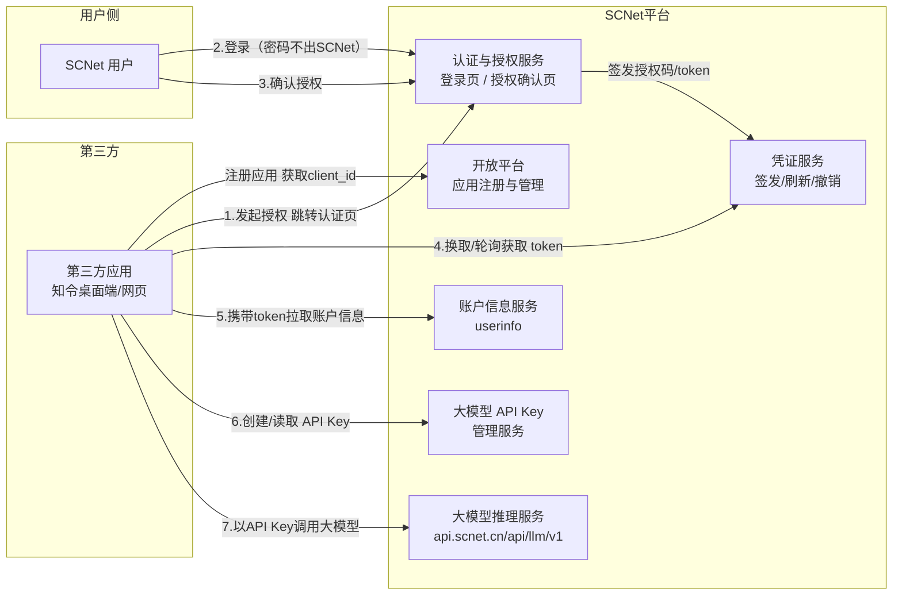
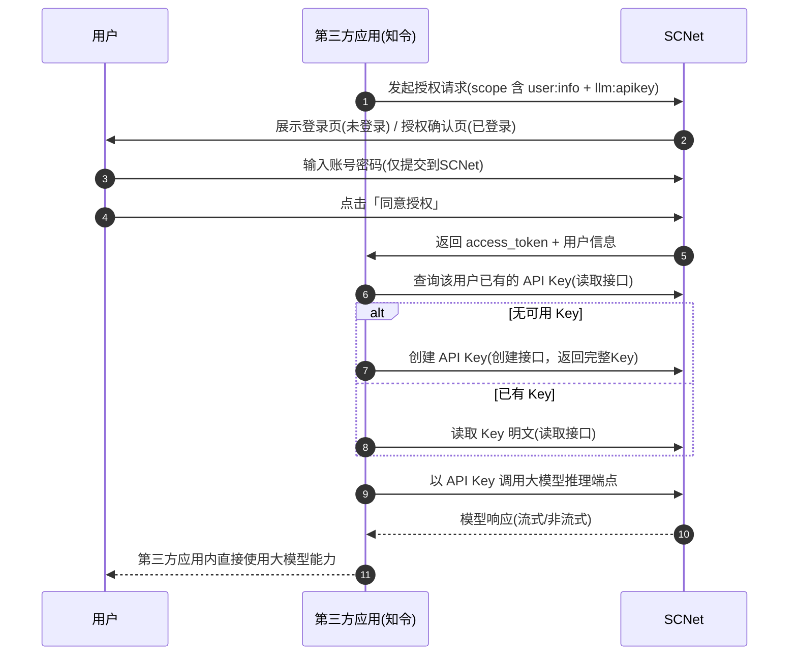
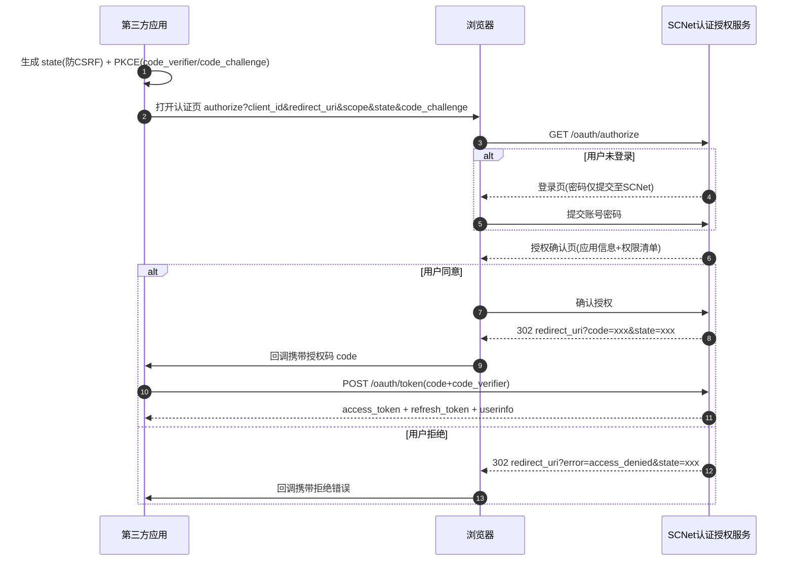
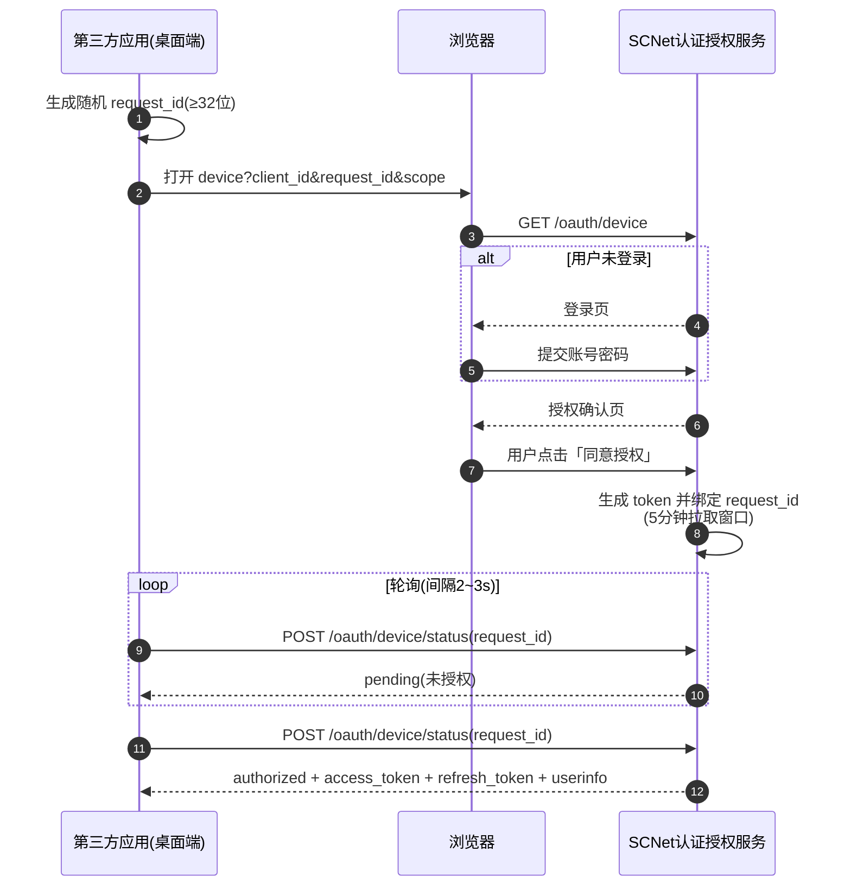

# SCNet 平台第三方对接需求书

## 需求一：第三方统一认证授权（OAuth 式登录）
## 需求二：大模型 API Key 管理接口（创建 / 读取）

---

| 项目 | 内容 |
| --- | --- |
| 文档版本 | v1.0 |
| 编制日期 | 2026-08-22 |
| 提交方 | 西安禾成讴沃信息科技有限公司（知令团队） |
| 对接方 | 国家超算互联网平台（SCNet）研发团队 |
| 密级 | 内部（双方对接人员） |

> 📎 本文档的示意图（含流程图、时序图、页面线框图）另附渲染版页面：
> [SCNet统一认证与API-Key管理-示意图.html](./SCNet统一认证与API-Key管理-示意图.html)

---

## 1. 需求背景与目标

### 1.1 背景

我方产品「知令」是一款桌面端 AI 全流程工作平台，计划集成 SCNet 平台的**用户体系**与**大模型服务**，为用户提供"登录一次、直接可用"的无缝体验。具体诉求：

1. **用户体系集成**：知令需要 SCNet 提供类似知令桌面端自身登录方式的**第三方授权登录**能力——用户在 SCNet 官方页面完成登录与授权，知令仅获得授权凭证与必要账户信息，**全程不接触用户密码**。
2. **大模型服务接通**：SCNet 已提供 OpenAI 兼容的大模型 API（`https://api.scnet.cn/api/llm/v1`），其鉴权依赖 API Key。但当前 API Key 仅支持在 SCNet 网页控制台手动创建与查看，**无开放接口**，第三方应用无法为用户"无感"完成 Key 的创建与获取，导致大模型能力无法随授权自动跑通。

### 1.2 目标

| # | 目标 |
| --- | --- |
| G1 | SCNet 提供标准、安全的**第三方应用授权登录**能力（OAuth 式），用户密码不出 SCNet |
| G2 | 用户已登录 SCNet 时授权流程直达确认页；未登录时先登录、后自动回到授权流程 |
| G3 | 用户同意授权后，第三方可获取**访问凭证（token）**与**必要账户信息** |
| G4 | SCNet 提供**大模型 API Key 管理开放接口**（至少：创建、读取），第三方可基于用户授权为用户自动创建/读取 Key |
| G5 | 实现"第三方发起授权 → 用户同意 → 自动创建/读取 Key → 无感跑通大模型"的端到端闭环 |

### 1.3 双赢价值

- **对 SCNet**：开放标准授权与 Key 管理能力，降低第三方接入门槛，吸引更多平台/工具集成 SCNet 大模型服务，提升 API 用量与生态覆盖。
- **对知令**：用户无需手动到控制台创建、复制 Key 再回填，体验闭环；不承担用户密码等敏感信息，安全合规风险低。
- **对用户**：账号密码只在 SCNet 官方页面出现；一次授权即可在第三方应用中使用自己的 SCNet 大模型资源，且授权随时可撤销。

---

## 2. 名词与约定

| 术语 | 说明 |
| --- | --- |
| SCNet | 国家超算互联网平台（www.scnet.cn / api.scnet.cn） |
| 第三方应用（Client） | 接入 SCNet 用户体系的第三方软件/平台，本文以「知令」为代表 |
| 开放平台应用 | 第三方在 SCNet 开放平台注册登记的应用，获得 `client_id` / `client_secret` |
| 授权码模式 | OAuth 2.0 Authorization Code Flow，配合 PKCE 使用 |
| PKCE | OAuth 2.0 的 Proof Key for Code Exchange（S256），保护无后端/桌面端公共客户端 |
| access_token / refresh_token | 短期访问凭证 / 长期刷新凭证 |
| scope | 权限范围声明，控制第三方可访问的账户能力 |
| API Key | SCNet 大模型服务的调用凭证（当前前缀 `sk-tp-` / `sk-sp-`，分别对应 Token Plan / Coding Plan） |
| 轮询模式 | 授权请求 ID + 状态轮询的授权模式（知令桌面端现有登录同款机制） |

> 域名约定：本文接口路径中的域名与路径为**建议值**，最终以 SCNet 发布的接口文档为准（见第 10 章待确认事项）。

---

## 3. 现状与差距分析

### 3.1 SCNet 现有能力

- **计算服务开放 API**：已具备 AK/SK 签名鉴权、凭证续约、凭证验证、用户信息查询等接口（开放平台文档「平台功能 API → 认证授权」模块），主要面向作业提交与集群管理等计算场景。
- **大模型服务**：提供 OpenAI / Anthropic 兼容推理端点（`https://api.scnet.cn/api/llm/v1`），配套 Token Plan / Coding Plan 套餐；鉴权使用 API Key。
- **API Key 管理**：仅支持网页控制台人工操作（创建/查看/复制/编辑/删除，入口：www.scnet.cn/ui/llm/apikeys），**无开放 API**。

### 3.2 差距

| # | 差距 | 影响 |
| --- | --- | --- |
| D1 | 无 OAuth 式第三方授权登录能力 | 第三方无法安全集成 SCNet 用户体系，用户需在第三方暴露 SCNet 密码（不可接受） |
| D2 | 无 API Key 管理开放接口 | 第三方无法为用户自动创建/读取 Key，无法无感跑通大模型，需用户手动往返控制台复制 Key |
| D3 | 无面向第三方应用的注册管理入口 | 缺少 client_id 签发、回调白名单、scope 授权治理等基础能力 |

---

## 4. 总体方案

### 4.1 方案总览

SCNet 侧新增两类能力，两者组合即可完成端到端闭环：

- **能力 A：第三方统一认证授权（需求一）**——OAuth 2.0 授权码模式（+PKCE）为主，辅以「授权请求 ID + 轮询」模式（知令桌面端同款，桌面场景友好）。
- **能力 B：大模型 API Key 管理接口（需求二）**——基于能力 A 签发的 access_token（或现有 AK/SK 体系）调用，至少提供创建、读取。

### 4.2 总体架构



### 4.3 两个需求的联动：无感跑通大模型

授权成功后，第三方应用基于用户授权自动完成 Key 准备，用户无需任何手动操作即可使用大模型能力：



---

## 5. 需求一：第三方统一认证授权（OAuth 式登录）

### 5.1 功能描述

与知令桌面端登录同类的交互体验：

1. 第三方应用发起授权，**拉起浏览器打开 SCNet 认证页面**；
2. 用户在 SCNet 认证页面**登录**（若已登录则跳过此步，**直接进入授权确认页**）；
3. 页面跳转至「**是否同意认证请求**」授权确认页，展示第三方应用信息与请求的权限；
4. 用户**同意** → SCNet 返回 **token 与必要账户信息**给第三方；用户**拒绝** → 第三方收到明确拒绝结果；
5. 全程用户密码仅提交至 SCNet 官方页面，**第三方不接触密码**。

### 5.2 前置能力：开放平台应用注册（SCNet 侧新增）

| 项 | 要求 |
| --- | --- |
| 应用注册 | 第三方在 SCNet 开放平台创建应用：名称、图标、主体信息、回调地址（redirect_uri）白名单、申请的 scope 清单 |
| 凭证签发 | 注册审核通过后签发 `client_id`；机密客户端（有服务端）另发 `client_secret`；公共客户端（桌面端/移动端）仅 `client_id` + PKCE |
| 回调白名单 | 支持精确匹配；为桌面端场景支持**回环地址**（`http://127.0.0.1` 任意端口，符合 OAuth 2.1 回环例外） |
| 授权治理 | 可配置 scope 审批、应用吊销、授权会话管理（用户侧可查看/撤销对某应用的授权） |

### 5.3 授权模式

#### 模式 A（推荐）：OAuth 2.0 授权码 + PKCE

标准授权码流程，适用于网页端与桌面端（桌面端用回环地址接收回调）：



#### 模式 B（桌面端友好）：授权请求 ID + 轮询（知令桌面端同款）

桌面端场景若不便接收浏览器回调（如无本地回环服务），可采用轮询模式：第三方生成高熵 `request_id`，用户完成授权后，第三方轮询状态接口领取凭证。

> 该模式即知令桌面端当前登录机制的通用化版本（知令实现细节见附录 A），SCNet 可参照实现。



### 5.4 页面需求

#### 5.4.1 登录页

- **复用 SCNet 现有登录页**（或独立授权登录页，风格与主站一致）；
- 登录成功后**自动回跳**授权确认页，不中断授权流程；
- 页面需提示本次登录的目的（如"为完成第三方应用授权，请登录 SCNet 账号"）。

#### 5.4.2 授权确认页（核心页面）

元素要求（线框示意图见 HTML 渲染版）：

| 区域 | 内容要求 |
| --- | --- |
| 头部 | SCNet 品牌标识 + 标题「第三方应用授权」 |
| 应用卡片 | 第三方应用图标、名称（如"知令 ZHILING"）、开发主体、已认证标识（如适用） |
| 当前账号 | 当前登录用户头像、昵称、账号；提供「切换账号」入口 |
| 权限清单 | 将本次请求的 scope 转为人类可读文案逐项展示（示例见 5.5.1 scope 设计） |
| 操作按钮 | 「拒绝」与「同意授权」双按钮；同意为强调样式 |
| 安全提示 | 明确文案："您的账号密码仅用于 SCNet 登录，不会提供给第三方应用。" |
| 响应式 | 适配 PC 与移动端浏览器 |

#### 5.4.3 授权结果页（模式 B）

- 同意后展示「授权成功，请返回第三方应用」；
- 拒绝后展示「已拒绝授权」并可关闭页面。

### 5.5 接口规格

> 认证页面域名建议 `www.scnet.cn`，接口域名建议 `api.scnet.cn`；路径为建议值。

#### 5.5.1 授权端点（网页，模式 A）

```
GET https://www.scnet.cn/oauth/authorize
```

| 参数 | 必填 | 说明 |
| --- | --- | --- |
| response_type | 是 | 固定 `code` |
| client_id | 是 | 开放平台应用 ID |
| redirect_uri | 是 | 回调地址，须在应用白名单内 |
| scope | 是 | 空格分隔的权限列表（见下） |
| state | 是 | 第三方生成随机串，防 CSRF，原样回传 |
| code_challenge | 是 | PKCE S256 挑战值 |
| code_challenge_method | 是 | 固定 `S256` |

**scope 设计（建议，SCNet 可裁剪）：**

| scope | 含义 | 授权页文案（示例） |
| --- | --- | --- |
| user:info | 读取用户基本信息 | 读取您的账户基本信息（昵称、账号、邮箱等） |
| llm:apikey:create | 创建大模型 API Key | 为您自动创建大模型 API Key |
| llm:apikey:read | 读取大模型 API Key | 读取您的大模型 API Key |
| （预留）job:read / job:submit | 计算服务相关 | 后续按需扩展 |

回调行为：
- 同意：`302 redirect_uri?code={授权码}&state={state}`（授权码单次有效，建议 60s 过期）
- 拒绝：`302 redirect_uri?error=access_denied&state={state}`

#### 5.5.2 令牌端点

```
POST https://api.scnet.cn/oauth/token
Content-Type: application/x-www-form-urlencoded
```

授权码换凭证：

| 参数 | 必填 | 说明 |
| --- | --- | --- |
| grant_type | 是 | `authorization_code` |
| code | 是 | 上一步获得的授权码 |
| redirect_uri | 是 | 须与授权请求一致 |
| client_id | 是 | 应用 ID |
| client_secret | 机密客户端必填 | 应用密钥 |
| code_verifier | PKCE 客户端必填 | PKCE 校验值 |

响应（成功，200）：

```json
{
  "access_token": "sna_xxxxxxxx",
  "token_type": "Bearer",
  "expires_in": 7200,
  "refresh_token": "snr_xxxxxxxx",
  "scope": "user:info llm:apikey:create llm:apikey:read",
  "userinfo": {
    "user_id": "18880001",
    "username": "zhangsan",
    "nickname": "张三",
    "email": "zhangsan@example.com",
    "mobile": "138****0000",
    "avatar": "https://cdn.scnet.cn/avatar/18880001.png",
    "org": "某某大学",
    "llm_subscription": {
      "token_plan_active": true,
      "coding_plan_active": false
    }
  }
}
```

> `userinfo` 为**可选增强**：直接随令牌响应返回，第三方可省去一次 userinfo 调用；若不返回，第三方按 5.5.3 拉取。`llm_subscription` 亦为可选扩展：帮助第三方判断用户是否有可用大模型套餐，决定后续 Key 策略。

刷新凭证：

| 参数 | 说明 |
| --- | --- |
| grant_type | `refresh_token` |
| refresh_token | 长期凭证 |
| client_id（+client_secret，机密客户端） | 应用标识 |

响应同成功结构（`refresh_token` 建议滚动续期）。

#### 5.5.3 用户信息端点

```
GET https://api.scnet.cn/oauth/userinfo
Authorization: Bearer {access_token}
```

响应（200）：

```json
{
  "user_id": "18880001",
  "username": "zhangsan",
  "nickname": "张三",
  "email": "zhangsan@example.com",
  "mobile": "138****0000",
  "avatar": "https://cdn.scnet.cn/avatar/18880001.png",
  "org": "某某大学"
}
```

> 字段说明：`user_id` 为 SCNet 用户唯一标识（第三方用它关联本地账户）；`email`/`mobile` 如涉及隐私合规可返回掩码或按 scope 分级；`org` 为可选扩展。

#### 5.5.4 撤销端点

```
POST https://api.scnet.cn/oauth/revoke
Content-Type: application/x-www-form-urlencoded
```

| 参数 | 说明 |
| --- | --- |
| token | 待撤销的 access_token 或 refresh_token |
| client_id（+client_secret） | 应用标识 |

用户亦可在 SCNet 个人中心查看并撤销对第三方应用的授权。

#### 5.5.5 模式 B 端点（轮询）

发起（网页）：

```
GET https://www.scnet.cn/oauth/device?client_id={client_id}&request_id={request_id}&scope=...
```

- `request_id`：第三方生成的 ≥32 位 URL-safe 随机串，服务端校验格式与熵；
- 页面流程与模式 A 相同（登录 → 确认 → 结果页），但**不产生浏览器回调**。

轮询状态：

```
POST https://api.scnet.cn/oauth/device/status
Content-Type: application/json

{ "client_id": "...", "client_secret": "...", "request_id": "..." }
```

响应状态机：

| status | 含义 | 返回内容 |
| --- | --- | --- |
| pending | 用户尚未确认 | `{ "status": "pending" }` |
| authorized | **首次**成功拉取 | `status` + `access_token` + `refresh_token` + `expires_in` + `userinfo` |
| active | 已拉取过，凭证仍有效 | 同上或仅 `status`（由 SCNet 定义，建议仍返回凭证以便客户端恢复） |
| denied | 用户拒绝 | `{ "status": "denied" }` |
| expired | 超时（建议 5 分钟）或已撤销 | `{ "status": "expired" }` |

#### 5.5.6 错误码

| 错误码 | 说明 |
| --- | --- |
| invalid_request | 请求参数缺失/格式错误 |
| unauthorized_client | 客户端未注册/被禁用 |
| invalid_client | 客户端凭证校验失败 |
| invalid_grant | 授权码/刷新凭证无效或已使用 |
| unsupported_grant_type | 不支持的 grant_type |
| access_denied | 用户拒绝授权 |
| invalid_scope | scope 非法或超出应用申请范围 |
| unsupported_response_type | response_type 不支持 |
| server_error | 服务端错误（建议统一 JSON 结构返回） |

### 5.6 安全要求

| # | 要求 |
| --- | --- |
| S1 | 全程 HTTPS；授权码单次有效、60s 过期；`state` 强制校验 |
| S2 | 轮询模式按（IP + request_id）滑动窗口限流（参照知令：5 分钟窗口），防枚举与爆破 |
| S3 | 每用户对同一应用的活跃授权会话数设上限（参照知令：5 个，超出可淘汰最旧会话） |
| S4 | access_token 有效期建议 2 小时；refresh_token 至撤销长期有效、支持滚动续期 |
| S5 | 授权、换证、撤销全链路审计日志（用户、应用、时间、IP、scope） |
| S6 | 登录页接入 SCNet 现有风控（验证码/风控策略），授权确认页对敏感 scope 可要求二次确认 |
| S7 | 用户可在 SCNet 侧查看并撤销任一第三方应用的授权；撤销后相关 access_token/refresh_token 立即失效 |
| S8 | token 与 Key 明文不得出现在 SCNet 日志中；响应头禁止缓存（no-store） |

---

## 6. 需求二：大模型 API Key 管理接口

### 6.1 功能描述

在 SCNet 开放平台新增**大模型 API Key 管理接口**，使第三方应用在获得用户授权后，可以：

- **创建** API Key（返回完整 Key，仅一次展示）；
- **读取** API Key（列表 + 按需获取完整明文，用于无感配置到推理客户端）；
- 可选：更新名称、删除（本期至少保证创建 + 读取）。

### 6.2 鉴权方式

| 方式 | 说明 |
| --- | --- |
| OAuth access_token（推荐） | 由需求一签发，`Authorization: Bearer {access_token}`，依赖 scope：`llm:apikey:create`、`llm:apikey:read` |
| AK/SK 签名（可选兼容） | 与 SCNet 现有计算服务开放 API 体系统一，便于存量开发者复用 |

### 6.3 接口规格

> 建议路径前缀：`https://api.scnet.cn/openapi/llm/v1/api-keys`（与推理端点 `/api/llm/v1` 区分，避免与 OpenAI 兼容路由冲突；最终以 SCNet 发布为准）。

#### 6.3.1 创建 API Key

```
POST /openapi/llm/v1/api-keys
Authorization: Bearer {access_token}   # scope: llm:apikey:create
Content-Type: application/json
```

请求：

```json
{
  "name": "zhiling-auto",
  "plan": "token_plan",
  "remark": "由知令应用自动创建"
}
```

| 字段 | 必填 | 说明 |
| --- | --- | --- |
| name | 是 | Key 名称，1~50 字符 |
| plan | 否 | 绑定套餐：`token_plan` / `coding_plan`；缺省=用户当前订阅套餐，无订阅返回错误 `PLAN_NOT_SUBSCRIBED` |
| remark | 否 | 备注，≤200 字符 |

响应（201）：

```json
{
  "key_id": "key_9f3a2c1b",
  "name": "zhiling-auto",
  "api_key": "sk-tp-xxxxxxxxxxxxxxxx",
  "masked_key": "sk-tp-****a2c1",
  "plan": "token_plan",
  "status": "active",
  "created_at": "2026-08-22T02:00:00+08:00"
}
```

> **`api_key` 完整明文仅在创建响应中返回一次**，服务端不得再次提供该创建响应的明文（后续通过 6.3.3 读取接口获取）。

#### 6.3.2 查询 API Key 列表

```
GET /openapi/llm/v1/api-keys?page=1&page_size=20
Authorization: Bearer {access_token}   # scope: llm:apikey:read
```

响应（200）：

```json
{
  "total": 2,
  "page": 1,
  "page_size": 20,
  "items": [
    {
      "key_id": "key_9f3a2c1b",
      "name": "zhiling-auto",
      "masked_key": "sk-tp-****a2c1",
      "plan": "token_plan",
      "status": "active",
      "created_at": "2026-08-22T02:00:00+08:00",
      "last_used_at": "2026-08-22T03:10:00+08:00"
    }
  ]
}
```

> 列表默认仅返回**掩码**，不返回明文。

#### 6.3.3 读取 API Key 明文

```
GET /openapi/llm/v1/api-keys/{key_id}/secret
Authorization: Bearer {access_token}   # scope: llm:apikey:read
```

响应（200）：

```json
{
  "key_id": "key_9f3a2c1b",
  "api_key": "sk-tp-xxxxxxxxxxxxxxxx"
}
```

> 每次读取须记录审计日志；建议在授权确认页将「读取 API Key」作为独立权限项向用户明示（见 5.5.1 授权页文案）。

#### 6.3.4 可选：更新名称 / 删除

| 接口 | 说明 |
| --- | --- |
| `PATCH /openapi/llm/v1/api-keys/{key_id}` | 更新 `name` / `remark` |
| `DELETE /openapi/llm/v1/api-keys/{key_id}` | 删除并立即禁用；同现有网页端语义（不可找回） |

#### 6.3.5 错误码

| 错误码 | 说明 |
| --- | --- |
| APIKEY_LIMIT_EXCEEDED | 超过每用户 Key 数量上限（建议 20） |
| PLAN_NOT_SUBSCRIBED | 用户未订阅指定套餐 |
| APIKEY_NOT_FOUND | Key 不存在或不属于当前用户 |
| INSUFFICIENT_SCOPE | 当前 token 缺少所需 scope |

### 6.4 约束与安全

| # | 要求 |
| --- | --- |
| K1 | Key 明文仅两个出口：创建响应（一次）与读取接口（需 scope 授权）；列表只返回掩码 |
| K2 | 创建、读取、删除全量审计日志；读取明文为敏感操作，建议触发用户站内通知 |
| K3 | 并发创建需保证幂等性与唯一性（以 `key_id` 为唯一标识，`name` 不强制唯一） |
| K4 | 数量上限、套餐绑定规则需明确返回业务错误码，便于第三方自动降级处理 |
| K5 | 接口限流（按 token/用户维度），防滥用 |
| K6 | 与现有网页控制台的 Key 数据模型互通（网页创建的 Key 亦可通过接口读取，反之亦然） |

---

## 7. 端到端验收场景（知令侧）

以知令桌面端为例的完整用户旅程（验收用例）：

| # | 场景 | 期望结果 |
| --- | --- | --- |
| U1 | 用户未登录 SCNet，在知令点击「SCNet 账号登录」 | 浏览器打开 SCNet 登录页；密码仅提交至 SCNet |
| U2 | 登录成功后 | 自动跳转授权确认页，展示知令应用信息与权限清单 |
| U3 | 用户已登录 SCNet 时再次发起 | 跳过登录页，直达授权确认页 |
| U4 | 用户点击「拒绝」 | 知令收到 access_denied（或 denied），流程终止，无凭证泄露 |
| U5 | 用户点击「同意授权」 | 知令获得 access_token + refresh_token + 用户信息（user_id/昵称/邮箱等） |
| U6 | 授权后自动准备 Key（用户无 Key） | 知令调用创建接口，获得完整 `sk-tp-` Key |
| U7 | 授权后自动准备 Key（用户已有 Key） | 知令调用列表/明文读取接口，获得可用的完整 Key |
| U8 | 大模型调用 | 知令以该 Key + `https://api.scnet.cn/api/llm/v1` 完成一次 chat/completions 调用（流式与非流式） |
| U9 | 用户撤销授权 | 知令侧凭证失效；知令提示重新授权 |
| U10 | token 过期 | refresh_token 可刷新；刷新失败时引导用户重新授权 |
| U11 | 用户在 SCNet 网页删除该 Key | 知令侧调用返回鉴权失败，可自动触发重新创建 Key 流程 |

---

## 8. 非功能需求

| 类别 | 要求 |
| --- | --- |
| 可用性 | 认证授权服务可用性 ≥ 99.9%；高峰期授权页打开延迟 ≤ 2s |
| 兼容性 | 认证页适配 Chrome/Edge/Firefox/Safari 及移动端浏览器 |
| 文档 | 提供正式开放 API 文档（参数、错误码、示例）与沙箱联调环境 |
| 可观测 | 授权与 Key 操作全链路日志，支持按用户/应用维度检索 |
| 合规 | 用户隐私字段（邮箱/手机号）返回策略明确，遵守个人信息保护要求 |

---

## 9. 交付与验收标准（SCNet 侧）

| # | 交付物 | 验收标准 |
| --- | --- | --- |
| A1 | 开放平台应用注册能力 | 第三方可注册应用、配置回调白名单与 scope，获得 client_id/client_secret |
| A2 | 授权端点与确认页 | 5.4/5.5 定义流程全部可走通；U1~U5 场景通过 |
| A3 | 令牌/用户信息/刷新/撤销接口 | U9、U10 场景通过；错误码规范 |
| A4 | 轮询模式（模式 B） | 无回调环境可完成授权并领取凭证；限流生效 |
| A5 | API Key 创建/读取接口 | U6、U7 场景通过；明文仅在约定出口出现 |
| A6 | 端到端跑通 | U8 场景通过：授权后无感完成大模型调用 |
| A7 | 文档与沙箱 | 开放 API 文档 + 联调沙箱环境可用 |

---

## 10. 待确认事项（请 SCNet 侧反馈）

1. 授权端点 / 接口最终路径与域名分配；
2. 应用注册是否需人工审核，审核周期与所需材料；
3. scope 权限清单最终定义（是否按本文建议裁剪/扩展）；
4. API Key 明文读取是否允许，是否需要额外的用户二次确认；
5. Key 管理接口是否同时支持 AK/SK 签名调用；
6. 每用户 API Key 数量上限、与 Token Plan / Coding Plan 绑定规则、未订阅用户策略；
7. userinfo 字段最终范围（邮箱是否明文、是否含机构信息）；
8. access_token / refresh_token 有效期参数；
9. 沙箱联调环境地址与技术支持接口人；
10. 第三方接入的计费政策（是否收费、是否影响套餐折扣）。

---

## 附录 A：知令桌面端现有授权流程参考（同类实现说明）

知令桌面端当前登录即采用"授权请求 ID + 轮询"机制，可作为模式 B 的实现参照：

| 环节 | 知令实现要点 |
| --- | --- |
| 发起 | 桌面端生成随机 `request_id`，用系统浏览器打开授权页 `GET /profile/desktop-auth/?request_id=xxx` |
| 登录判断 | 服务端判断会话：已登录 → 渲染授权确认页（文案："知令桌面软件正在请求登录授权，请确认授权以允许其访问您的账户"）；未登录 → 页内登录表单，登录成功后重定向回授权页 |
| 确认 | 用户确认后生成 token（`secrets.token_urlsafe(32)`），绑定 request_id，进入 5 分钟可拉取窗口 |
| 领取 | 桌面端轮询 `POST /api/profile/desktop-auth-status/`（request_id）：首次成功返回 `status=authorized` + token + 账户信息（登录 ID/用户名/邮箱/昵称/头像）；此后同一 request_id 返回 `status=active` 且仍返回 token（便于客户端恢复凭据） |
| 失效 | 超时未领取 → expired；用户撤销 → expired；token 长期有效直至撤销 |
| 安全 | HTTPS；按 IP+request_id 滑动窗口限流（5 分钟窗口）；每用户活跃会话上限 5 个（超出淘汰最旧）；审计日志 |

该机制已在知令产品中运行验证，SCNet 可参照实现模式 B，并在此基础上扩展为标准 OAuth（模式 A）以满足更广泛场景。

## 附录 B：参考资料

- SCNet 开放平台 API 文档（平台功能 API / 认证授权）：https://www1.scnet.cn/ac/openapi/doc/2.0/api/safecertification/get-user-tokens-aksk.html
- SCNet 开放平台 API 文档（大模型入门指南）：https://www1.scnet.cn/ac/openapi/doc/2.0/moduleapi/tutorial/quickstart.html
- SCNet API Key 管理说明（网页端现状）：https://www1.scnet.cn/ac/openapi/doc/2.0/moduleapi/tutorial/apikeymgt.html
- OAuth 2.0 授权码模式与 PKCE：RFC 6749 / RFC 7636；OAuth 2.1 草案（回环地址例外）
- 知令桌面端授权实现（内部参考）：[desktop.py]([1]:/opt/ovoweb/zhilingsite/users_profile/views/desktop.py)

---

*本需求书由知令团队编制，供 SCNet 研发评估与排期。文中接口路径、参数、限制值均为建议值，欢迎 SCNet 侧评审调整。*
