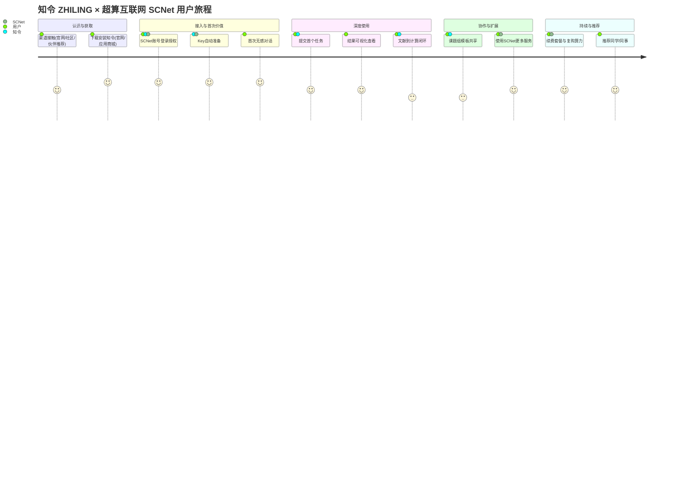
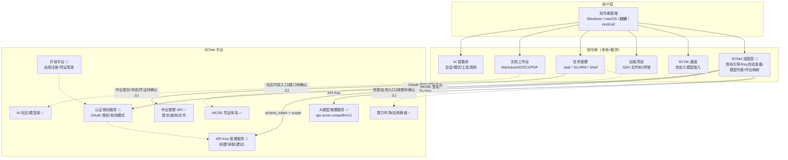
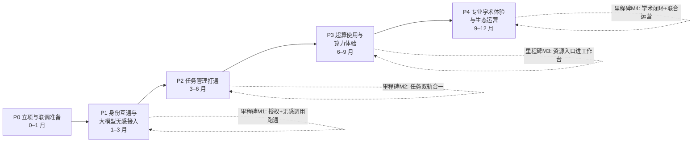

# 知令 ZHILING × 超算互联网 SCNet 体验改善方案

> **副标题**：从「多平台来回切换」到「一个工作台跑通全流程」的联合体验蓝图
>
> **联合品牌**：知令 ZHILING × 超算互联网 SCNet

| 项目 | 内容 |
| --- | --- |
| 文档版本 | v1.0 |
| 编制日期 | 2026-08-22 |
| 编制方 | 西安禾成讴沃信息科技有限公司（知令团队） |
| 呈报对象 | 国家超算互联网平台（SCNet）管理层 / 合作决策者 |
| 密级 | 内部（双方对接人员） |
| 关联文档 | [SCNet统一认证与API-Key管理需求文档.md](./SCNet统一认证与API-Key管理需求文档.md)（技术需求书，本方案的工程依据） |
| 配套渲染版 | [SCNet统一认证与API-Key管理-示意图.html](./SCNet统一认证与API-Key管理-示意图.html) |

> **标注约定（全文统一）**：
> - ✅ **已具备**：双方当前已上线、可验证的能力；
> - 🧭 **规划建议**：本方案建议、尚未落地的设计，双方确认后进入排期；
> - ⚠️ **依赖SCNet确认**：必须由 SCNet 侧决策、开发或发布后方可成立的事项。
>
> 本文严格遵循上述区分，不把规划写成已实现。所有接口路径、参数、限制值均沿用需求文档中的**建议值**，最终以 SCNet 正式发布的接口文档为准。

---

## 目录

1. [执行摘要](#1-执行摘要)
2. [合作价值](#2-合作价值)
3. [现状与差距分析](#3-现状与差距分析)
4. [四大体验主题](#4-四大体验主题)
5. [用户画像与用户旅程](#5-用户画像与用户旅程)
6. [产品与数据架构](#6-产品与数据架构)
7. [关键流程设计](#7-关键流程设计)
8. [合作模式](#8-合作模式)
9. [分阶段路线图](#9-分阶段路线图)
10. [可量化指标](#10-可量化指标)
11. [风险与边界](#11-风险与边界)
12. [待双方确认事项](#12-待双方确认事项)
13. [验收标准](#13-验收标准)
14. [结论](#14-结论)
15. [附录 A：资料来源与引用](#附录-a资料来源与引用)
16. [附录 B：术语表](#附录-b术语表)

---

## 1. 执行摘要

**知令**是一款桌面端 AI 全流程工作平台，覆盖「AI 智能体对话、文档与代码编辑、计算任务管理、远程集群对接、数据分析与可视化」全链路（[README.md](../README.md)）。**国家超算互联网平台（SCNet）**汇聚全国超算资源，已对外提供计算服务开放 API、大模型推理服务（OpenAI/Anthropic 兼容端点）与 Token Plan / Coding Plan 套餐（[SCNet 大模型入门指南](https://www1.scnet.cn/ac/openapi/doc/2.0/moduleapi/tutorial/quickstart.html)）。

**核心判断**：双方能力高度互补，但体验链路上存在一个关键断点——SCNet 的大模型能力、作业体系与用户身份体系目前只能通过网页控制台「人肉」衔接第三方工具，用户必须在控制台手动创建、复制 API Key 再回填，无法在桌面工作流中「登录一次、直接可用」。

**本方案主张**：

1. **打通身份与凭证（最小可行闭环）**：SCNet 开放「第三方统一认证授权（OAuth 式）」与「大模型 API Key 管理接口」两项能力（工程细节见 [SCNet统一认证与API-Key管理需求文档.md](./SCNet统一认证与API-Key管理需求文档.md)），知令作为首批第三方应用接入。用户一次授权，即可在知令内无感使用自己的 SCNet 大模型资源，**密码全程不出 SCNet、Key 自动准备**。
2. **由点及面拉通四大体验主题**：在身份互通基础上，依次打通**大模型使用、任务管理、超算使用、专业学术体验**四大主题，将 SCNet 的算力、模型、应用与社区资源嵌入知令工作台，让「在知令里写完输入文件 → AI 检查 → 提交 SCNet 算力运行 → 结果回传可视化」成为一条直线。
3. **联合品牌共同运营**：以「知令 ZHILING × 超算互联网 SCNet」联合品牌对外发布，形成「国家级平台 × 桌面工作台」的体验标杆，并向更多第三方应用复制。

**分阶段落地**：P0 立项联调 → P1 身份互通与大模型无感接入（1–3 个月）→ P2 任务管理打通（3–6 个月）→ P3 超算使用与算力体验（6–9 个月）→ P4 专业学术体验与生态运营（9–12 个月）。各阶段均有明确退出标准与验收用例（见 [9. 分阶段路线图](#9-分阶段路线图)、[13. 验收标准](#13-验收标准)）。

**决策请求**：请 SCNet 管理层确认本文 [12. 待双方确认事项](#12-待双方确认事项) 中技术类事项（尤其是 OAuth 端点、API Key 明文读取策略、应用注册审核流程），授权研发团队立项排期，并指定双方接口人进入 P0 联调。

---

## 2. 合作价值

### 2.1 对 SCNet：把平台能力延伸进用户工作台

| 价值点 | 说明 |
| --- | --- |
| **大模型 API 用量与留存提升** | 用户在知令内即可持续调用 SCNet 大模型服务（`https://api.scnet.cn/api/llm/v1`），消除「控制台复制 Key」环节，降低每次使用的摩擦成本，促进 Token Plan / Coding Plan 套餐的活跃使用（套餐现状见 [大模型入门指南](https://www1.scnet.cn/ac/openapi/doc/2.0/moduleapi/tutorial/quickstart.html)） |
| **算力与应用的桌面级入口** | SCNet 算力市场、应用商城中的 VASP、LAMMPS、GROMACS、AlphaFold3 等应用（[SCNet 官网](https://www.scnet.cn/)）通过知令触达「写文件 → 提交 → 看结果」的工作流，而不只是一个网页入口 |
| **降低第三方接入门槛，放大生态效应** | 开放 OAuth 式授权与 Key 管理接口后，受益方不止知令——任何桌面端/网页端工具都能按同样标准接入 SCNet，知令可成为第一个「样板间」🧭 |
| **数据与凭证安全合规** | 用户密码仅出现在 SCNet 官方页面，第三方不接触密码；Key 生命周期始终由 SCNet 侧管控（约束见需求文档 6.4 节）✅（安全要求为需求文档建议，落地依赖 SCNet 确认 ⚠️） |
| **国家级平台的体验标杆** | 「知令 ZHILING × 超算互联网 SCNet」联合品牌可作为平台生态合作的示范案例对外宣传 🧭 |

### 2.2 对知令：补齐国家级平台的用户体系与模型服务

| 价值点 | 说明 |
| --- | --- |
| **用户体系升级** | 知令现有登录为自有账号体系（桌面端采用「授权请求 ID + 轮询」机制，见需求文档附录 A）✅；对接 SCNet 后新增「SCNet 账号登录」入口，覆盖高校、科研院所与工程机构的 SCNet 存量用户 🧭 |
| **模型服务扩充** | 知令现有多模型（DeepSeek、Kimi、Doubao、Mimo 等）与 BYOK 自带 API 能力 ✅（[README.md](../README.md)）；接入 SCNet 后，用户订阅的 SCNet Token Plan / Coding Plan 模型可一键出现在知令模型列表 🧭 |
| **借力平台公信力** | 与国家超算互联网平台的官方合作，增强知令在科研与工程用户群体中的信任度 |

### 2.3 对用户：一次授权、无感可用、全流程统一

| 价值点 | 说明 |
| --- | --- |
| **省去手动步骤** | 不再需要「登录控制台 → 创建 Key → 复制 → 回填第三方」；授权一次，Key 自动创建/读取、自动配置 🧭 |
| **安全放心** | 账号密码只在 SCNet 官方页面出现；授权随时可在 SCNet 侧撤销 🧭 |
| **体验统一** | 大模型对话、任务提交、结果查看、文献阅读在同一工作台完成，减少 3~5 个工具之间的切换（工具现状见 [README.md](../README.md)）✅ |

### 2.4 对生态：可复制的第三方接入范式

本合作沉淀出的「应用注册 → OAuth 授权 → Key 管理 → 推理调用」标准链路，可沉淀为 SCNet 开放平台的通用接入指南与 SDK，供后续第三方应用低成本复用 🧭（是否公开推广由 SCNet 决定 ⚠️）。

---

## 3. 现状与差距分析

> 本章事实来源：SCNet 侧能力来自需求文档 3.1 节及官方开放平台文档；知令侧能力来自 [README.md](../README.md)、[intro.md](../intro.md) 及需求文档附录 A。

### 3.1 SCNet 现有能力盘点（✅ 已具备）

| 能力 | 现状说明 | 官方来源 |
| --- | --- | --- |
| 计算服务开放 API | 已具备 AK/SK 签名鉴权、凭证续约、凭证验证、用户信息查询等接口，主要面向作业提交与集群管理 | [开放平台·认证授权](https://www1.scnet.cn/ac/openapi/doc/2.0/api/safecertification/get-user-tokens-aksk.html) |
| 作业管理开放 API | 已具备查询集群信息、提交作业、查询作业列表/详情、查看文件、删除作业等接口 | [开放平台文档导航](https://www1.scnet.cn/ac/openapi/doc/2.0/moduleapi/tutorial/quickstart.html) |
| 大模型推理服务 | OpenAI 兼容端点 `https://api.scnet.cn/api/llm/v1`、Anthropic 兼容端点，配套 Token Plan（`sk-tp-`）/ Coding Plan（`sk-sp-`）套餐 | [大模型入门指南](https://www1.scnet.cn/ac/openapi/doc/2.0/moduleapi/tutorial/quickstart.html) |
| API Key 管理（网页） | 仅支持控制台人工创建/查看/复制/编辑/删除，**无开放接口** | [API Key 管理说明](https://www1.scnet.cn/ac/openapi/doc/2.0/moduleapi/tutorial/apikeymgt.html) |
| 平台生态 | 算力市场、应用商城、AI 社区、智能体服务、核心节点、模型服务等 | [SCNet 官网](https://www.scnet.cn/)、[AI 社区](https://www.scnet.cn/ui/aihub) |
| 用户资源 API | 查询用户信息、添加成员、配置用户存储、查询成员作业等 | [开放平台文档导航](https://www1.scnet.cn/ac/openapi/doc/2.0/moduleapi/tutorial/quickstart.html) |

### 3.2 知令现有能力盘点（✅ 已具备）

| 能力 | 现状说明 | 来源 |
| --- | --- | --- |
| AI 智能体 | 多会话、多模型切换、Agent/Ask/Plan/Research/Debug 等多种工作模式、技能包、流式输出与工具调用 | [README.md](../README.md)、[intro.md](../intro.md) |
| BYOK 自带 API | 支持自定义 Base URL / Model Id / API Key 扩展模型列表（当前接入 SCNet 大模型需手动走此通道） | [intro.md](../intro.md) |
| 文档工作台 | Markdown（含 Mermaid/LaTeX）、DOCX 编辑、PDF 阅读与高质量转 Markdown（MinerU 云端转换） | [intro.md](../intro.md) |
| 计算任务管理 | `.task` 任务文件统一描述作业，支持 SLURM 与本地 Shell；提交后自动轮询状态、查看日志、Plotly 可视化；AI 可自然语言驱动提交 | [README.md](../README.md) |
| 远程项目 | SSH 文件树/编辑/搜索、多标签远程终端、连接池管理 | [intro.md](../intro.md) |
| 数据与知识 | PostgreSQL / MongoDB 连接查询、知识库浏览管理 | [README.md](../README.md) |
| 自动化与协作 | 定时任务、邮件事件触发、邮箱集成 | [README.md](../README.md) |
| 桌面端授权机制 | 自有「授权请求 ID + 轮询」登录机制已上线运行（限流、会话上限、审计等安全实践），可作为 SCNet 授权能力设计的参照实现 | [需求文档附录 A](./SCNet统一认证与API-Key管理需求文档.md) |
| 多平台 | Windows / macOS / 麒麟 V10、V11 / Android | [README.md](../README.md) |

### 3.3 体验差距分析

SCNet 侧的技术差距（需求文档 3.2 节）直接造成用户体验断点：

| # | 差距（需求文档编号） | 用户侧体验后果 |
| --- | --- | --- |
| D1 | 无 OAuth 式第三方授权登录能力 ⚠️ | 用户无法在第三方应用安全使用 SCNet 身份；要么暴露密码（不可接受），要么放弃 |
| D2 | 无 API Key 管理开放接口 ⚠️ | 用户必须手动往返控制台创建/复制 Key 回填；Key 丢失、套餐变更、Key 被删后都要再跑一趟 |
| D3 | 无面向第三方应用的注册管理入口 ⚠️ | 第三方应用无从获得 `client_id`、配置回调与权限，接入无从谈起 |

由此形成的**体验层差距**（对照四大主题）：

| 主题 | 今天（无对接） | 差距本质 |
| --- | --- | --- |
| 大模型使用 | 知令中只能用 BYOK 手动粘贴 SCNet Key，模型列表与套餐状态不可见 | 「凭证准备」打断工作流 |
| 任务管理 | 知令 `.task` 通过 SSH+SLURM 直连用户自管集群；SCNet 开放平台的作业 API 未与知令打通 | 两套任务体系并存 |
| 超算使用 | SCNet 算力市场与应用商城只在网页端可触达，与用户本地的输入文件准备、结果分析脱节 | 资源入口与工作流割裂 |
| 专业学术体验 | 知令的 PDF/文献/DOCX 能力与 SCNet 的应用商城、AI 社区内容互相不可见 | 内容与工具互相孤立 |

### 3.4 差距对应的能力缺口

| 缺口 | 归属 | 状态 |
| --- | --- | --- |
| OAuth 式授权（授权端点、令牌、用户信息、撤销、轮询模式） | SCNet 新增开发 | ⚠️ 依赖SCNet确认（需求文档第 5 章） |
| 大模型 API Key 管理接口（创建/读取，可选更新/删除） | SCNet 新增开发 | ⚠️ 依赖SCNet确认（需求文档第 6 章） |
| 开放平台应用注册与管理（`client_id` 签发、回调白名单、scope 治理） | SCNet 新增开发 | ⚠️ 依赖SCNet确认（需求文档 5.2 节） |
| 知令侧 SCNet 适配层（登录入口、授权引导、Key 自动准备、模型列表同步） | 知令开发 | 🧭 规划建议（随 P1 排期） |
| 知令侧作业 API 适配（SCNet 作业 API ↔ `.task` 映射） | 知令开发 | 🧭 规划建议（随 P2 排期） |
| 应用商城/算力市场/社区内容在知令内的触达 | 双方共建 | 🧭 规划建议（随 P3/P4 排期） |

---

## 4. 四大体验主题

> 每项主题按「今天 → 改善后 → 支撑能力」展开；支撑能力逐一标注 ✅已具备 / 🧭规划建议 / ⚠️依赖SCNet确认。

### 4.1 主题一：大模型使用体验（T1）

**今天的痛点**：SCNet 用户想在知令里用自己的 Token Plan 模型，需要到控制台手动创建 Key、复制、再粘贴到知令 BYOK 配置；套餐余量、模型可用范围在知令内不可见。

**改善后的目标体验**：

1. 知令设置中出现「SCNet 账号登录」入口，点击后在 SCNet 官方页面登录并授权，知令获得凭证与账户信息（**密码不出 SCNet**）🧭
2. 授权成功后，知令自动检查用户已有 Key：无则自动创建（`sk-tp-`/`sk-sp-`），有则读取并配置到本地推理客户端，**全程零手动** 🧭
3. 会话模型列表中直接出现用户 SCNet 套餐内的模型，可切换、可流式对话；套餐不可用时给出可理解的引导提示 🧭
4. 用户在 SCNet 侧撤销授权或删除 Key 后，知令即时感知并引导重新授权，不留「静默失效」的坑 🧭

**支撑能力**：

| 能力 | 状态 |
| --- | --- |
| SCNet 大模型推理端点（OpenAI/Anthropic 兼容） | ✅ 已具备（[大模型入门指南](https://www1.scnet.cn/ac/openapi/doc/2.0/moduleapi/tutorial/quickstart.html)） |
| 知令 BYOK 通道（自定义 Base URL / Model / Key） | ✅ 已具备（[intro.md](../intro.md)） |
| SCNet OAuth 式授权（模式 A 授权码+PKCE / 模式 B 轮询） | ⚠️ 依赖SCNet确认（需求文档第 5 章） |
| SCNet API Key 管理接口（创建/读取） | ⚠️ 依赖SCNet确认（需求文档第 6 章） |
| 知令 SCNet 适配层（凭证存储、Key 自动准备、模型列表） | 🧭 规划建议（P1 交付） |

### 4.2 主题二：任务管理体验（T2）

**今天的痛点**：知令的 `.task` 任务体系 ✅ 已支持 SLURM 集群与本地 Shell（[README.md](../README.md)），但仅面向用户自管的 SSH 集群；通过 SCNet 平台提交的作业（网页/开放平台）与知令内的任务视图互相独立，用户要开两套界面盯两类任务。

**改善后的目标体验**：

1. 知令任务视图中新增「SCNet」任务目标：选择集群、队列与资源，提交作业到 SCNet（复用开放平台作业 API）🧭
2. `.task` 与 SCNet 作业模型映射：排队/运行/结束状态自动同步，日志与结果文件可在知令内查看与可视化 🧭
3. AI 智能体统一驱动：「把这个任务提交到 SCNet 集群」与「提交到我自己的服务器」用同一种对话方式 🧭
4. 支持批量提交与失败重试指引，降低新手在队列、模块、资源参数上的踩坑率 🧭

**支撑能力**：

| 能力 | 状态 |
| --- | --- |
| 知令 `.task` 任务视图、状态轮询、日志/Plotly 可视化 | ✅ 已具备（[README.md](../README.md)） |
| SCNet 作业管理开放 API（提交/查询/详情/文件/删除） | ✅ 已具备（[开放平台文档导航](https://www1.scnet.cn/ac/openapi/doc/2.0/moduleapi/tutorial/quickstart.html)） |
| SCNet AK/SK 凭证在知令中的管理 | 🧭 规划建议（P2 交付；凭证获取流程依赖 SCNet 确认 ⚠️） |
| 作业 API 与 `.task` 的参数映射与状态机对齐 | 🧭 规划建议（P2 交付） |

### 4.3 主题三：超算使用体验（T3）

**今天的痛点**：SCNet 算力市场与应用商城（VASP、LAMMPS、GROMACS、AlphaFold3 等，[SCNet 官网](https://www.scnet.cn/)）是网页入口；用户购买算力/应用后，还要回到自己的电脑上准备输入文件、传文件、盯作业、拷结果，工具链断裂。

**改善后的目标体验**：

1. 「商城选资源 → 知令做工作」：用户可继续在网页端选购算力与应用，同时可在知令中直达 SCNet 资源与已购应用的工作流（写输入文件、AI 参数检查、提交、结果解析）🧭
2. 应用模板化：为 VASP/LAMMPS/GROMACS 等高频应用提供知令 `.task` 模板与 AI 检查清单，开箱即用 🧭
3. 结果可视化闭环：任务结束后的输出（日志、结构文件、能量/轨迹数据）在知令内用 Plotly 等直接呈现，减少导出再分析的往返 ✅（可视化引擎已具备）＋🧭（与 SCNet 应用输出格式适配）
4. 远程文件与算力的统一：SSH 远程项目 ✅ 与 SCNet 作业体系 🧭 在同一文件树/任务视图中管理

**支撑能力**：

| 能力 | 状态 |
| --- | --- |
| SCNet 算力市场、应用商城、模型服务 | ✅ 已具备（[SCNet 官网](https://www.scnet.cn/)、[模型服务](https://www.scnet.cn/ui/mall/service/llm)） |
| 知令 SSH 远程项目与终端 | ✅ 已具备（[intro.md](../intro.md)） |
| 知令内 SCNet 资源/应用入口与模板中心 | 🧭 规划建议（P3 交付） |
| 应用商城在知令内的展示与跳转（入驻/推广政策） | ⚠️ 依赖SCNet确认（应用商城合作政策见 [SCNet 官网](https://www.scnet.cn/) 商家中心） |

### 4.4 主题四：专业学术体验（T4）

**今天的痛点**：科研用户在文献阅读、论文写作、数据整理上依赖多个工具；SCNet AI 社区与模型库的内容、应用商城中的科学软件，与用户的日常学术工作流彼此孤立。

**改善后的目标体验**：

1. **文献到计算的贯通**：PDF 文献 → 知令高质量转 Markdown（MinerU，✅ 已具备，[intro.md](../intro.md)）→ AI 提取方法与参数 → 直接生成对应软件（如 VASP/LAMMPS）的输入文件草稿 → 提交 SCNet 算力复现/扩展 🧭
2. **论文工作流**：LaTeX/Markdown/DOCX 写作、AI 润色与图表内嵌（✅ 已具备）与 SCNet 大模型能力结合，形成「学术写作专用配置」🧭
3. **社区内容触达**：SCNet AI 社区、模型库、数据集资源在知令内以卡片/入口形式呈现，一键跳转官方页面（[AI 社区](https://www.scnet.cn/ui/aihub)）🧭
4. **知识与协作**：课题组知识库 ✅、任务与成员协作信息（SCNet 用户资源 API ✅ 已具备）在知令内沉淀 🧭

**支撑能力**：

| 能力 | 状态 |
| --- | --- |
| 知令 PDF 转高质量 Markdown、DOCX 编辑、知识库 | ✅ 已具备（[intro.md](../intro.md)） |
| SCNet AI 社区、模型库、数据集 | ✅ 已具备（[AI 社区](https://www.scnet.cn/ui/aihub)） |
| SCNet 用户资源 API（成员/存储） | ✅ 已具备（[开放平台文档导航](https://www1.scnet.cn/ac/openapi/doc/2.0/moduleapi/tutorial/quickstart.html)） |
| 「文献→输入文件→算力复现」端到端模板 | 🧭 规划建议（P4 交付） |
| 社区内容在知令内的接口化呈现 | ⚠️ 依赖SCNet确认（社区/商城的开放接口或合作授权） |

### 4.5 四大主题总览

| 主题 | 核心改善 | 首批可用节点 | 关键依赖 |
| --- | --- | --- | --- |
| T1 大模型使用 | 一次授权、无感跑通 | 授权后即可用 | ⚠️ OAuth + Key 接口（P1） |
| T2 任务管理 | 两套任务变一套 | 作业 API 打通后 | ⚠️ 凭证策略确认（P2） |
| T3 超算使用 | 资源入口进工作流 | 模板中心上线后 | ⚠️ 商城合作政策（P3） |
| T4 专业学术体验 | 文献→计算→论文闭环 | 端到端模板发布后 | ⚠️ 社区开放接口（P4） |

---

## 5. 用户画像与用户旅程

### 5.1 用户画像（4 类）

#### 画像 A：材料/化学计算研究者「王博」（高校博士生）

| 维度 | 描述 |
| --- | --- |
| 典型任务 | VASP 第一性原理、LAMMPS/GROMACS 分子动力学；写输入文件 → 排队提交 → 分析能量/轨迹 |
| 当前痛点 | 编辑、终端、集群监控、绘图四五个工具来回切换；输入文件参数易错；排队时间不可见导致反复刷新 |
| 改善后体验 | 知令内完成输入文件与 AI 检查 → 一键提交 SCNet 算力 → 状态与结果自动回传；文献方法可 AI 提取生成输入文件草稿 |
| 对应主题 | T1（写文件时用 SCNet 大模型）、T2（任务管理）、T3（超算使用）、T4（文献→计算闭环） |

#### 画像 B：工业仿真工程师「李工」（汽车/航空/气象海洋行业）

| 维度 | 描述 |
| --- | --- |
| 典型任务 | 结构/流体/电磁仿真批量作业；模板化配置；多工况批量提交；结果后处理 |
| 当前痛点 | 仿真软件模板配置繁琐；批量提交低效；结果文件大、回传与分析耗时；对数据安全与合规高度敏感 |
| 改善后体验 | 行业仿真模板 + `.task` 批量提交 SCNet 算力；结果在知令内解析可视化；凭证与文件受控，密码不出 SCNet |
| 对应主题 | T2（批量任务）、T3（算力资源）、T1（AI 辅助报告撰写） |

#### 画像 C：AI 应用开发者「陈同学」（学生/开发者）

| 维度 | 描述 |
| --- | --- |
| 典型任务 | 用 SCNet Token Plan / Coding Plan 做智能体、小模型应用开发与 API 调试 |
| 当前痛点 | Key 创建、复制、回填繁琐；Key 多、易混易丢；套餐余量与模型范围不清楚；调试时反复切控制台 |
| 改善后体验 | 知令授权后模型与 Key 自动就位；模型菜单显示可用范围；用量与失效状态在应用内可见、可恢复 |
| 对应主题 | T1（大模型使用）为主，兼 T2（训练/推理任务） |

#### 画像 D：课题组 PI / 平台管理员「刘老师」

| 维度 | 描述 |
| --- | --- |
| 典型任务 | 管理课题组成员、算力账号、用量与成本；向成员分发资源；关注合规与审计 |
| 当前痛点 | 成员各自管理 Key、用量分散不可见；资源分摊与报销口径不清晰；对新成员上手培训成本高 |
| 改善后体验 | SCNet 用户资源 API（成员/存储）与知令知识库结合：成员统一通过 SCNet 授权接入；用量按账号可查（API 支持范围以 SCNet 为准 ⚠️）；课题组模板与技能包一键下发 🧭 |
| 对应主题 | T1~T4 的管理侧视图 |

### 5.2 通用用户旅程（含触点与阶段产出）

### 5.3 画像完整旅程（以画像 A「王博」为例的端到端旅程）

> 其余画像的旅程结构相同，差异在「深度使用」环节，见 5.4 对照表。

| 阶段 | 触点在谁 | 王博的动作 | 系统/平台动作 | 阶段产出 | 对应阶段 |
| --- | --- | --- | --- | --- | --- |
| 1 发现 | SCNet/知令渠道 | 从 SCNet 应用商城或知令官网了解到「知令支持 SCNet 登录」 | 联合品牌物料露出 🧭 | 意向 | P4 后 |
| 2 获取 | 知令 | 下载安装知令（Windows/macOS/麒麟）✅ | 安装引导页含「SCNet 账号登录」入口 🧭 | 已安装 | P1 |
| 3 接入 | SCNet | 点击「SCNet 账号登录」，在 SCNet 官方页登录并同意授权 | SCNet 签发凭证；知令自动创建/读取 Key 并配置模型 🧭 | 一次授权即可用 | P1 |
| 4 首次价值 | 知令 | 在会话中选择 SCNet 模型，问「帮我检查 INCAR 参数」 | 知令以用户 Key 流式调用 SCNet 大模型 🧭 | 首次无感对话成功 | P1 |
| 5 深度使用 | 知令+SCNet | 用 `.task` 编写 VASP 任务并提交到 SCNet 集群 | 知令调用 SCNet 作业 API 提交、轮询状态 ✅＋🧭 | 首个任务跑通 | P2 |
| 6 结果处理 | 知令 | 在任务视图查看日志与能量曲线 | 日志回传、Plotly 可视化 ✅ | 结果入分析 | P2 |
| 7 扩展 | 知令+SCNet | 从文献 PDF 提取参数生成 LAMMPS 输入文件，再提交算力 | MinerU 转换 + AI 生成 + 任务提交 ✅＋🧭 | 文献→计算闭环 | P4 |
| 8 协作 | 知令 | 把模板共享给师弟，订阅课题组知识库 | 课题组模板/知识库 ✅＋🧭 | 团队复用 | P3/P4 |
| 9 持续 | SCNet | 查看用量、续费套餐、复购算力 | SCNet 控制台/知令内入口（入口形式待确认 ⚠️） | 留存与续费 | P3 |
| 10 推荐 | 双方 | 向同学推荐组合使用方式 | 联合品牌案例传播 🧭 | 口碑扩散 | 全程 |

### 5.4 各画像旅程差异对照

| 阶段 | 画像 A 王博 | 画像 B 李工 | 画像 C 陈同学 | 画像 D 刘老师 |
| --- | --- | --- | --- | --- |
| 首次价值 | AI 检查输入文件 | AI 辅助仿真报告 | 无感调用 SCNet 模型 | 查看成员接入情况 |
| 深度使用 | VASP/LAMMPS 任务 | 批量仿真任务 | API 调试/推理任务 | 资源分发与用量视图 |
| 扩展 | 文献→计算闭环 | 行业模板 | 多模型切换 | 课题组模板下发 |
| 关键诉求 | 少切换、少出错 | 批量、安全 | 无感、透明 | 可控、可审计 |

---

## 6. 产品与数据架构

### 6.1 总体架构

> 图例：实线=本期打通链路；虚线=后续阶段或待确认链路；✅/🧭/⚠️ 与全文标注约定一致。

### 6.2 模块职责

| 模块 | 归属 | 职责 | 状态 |
| --- | --- | --- | --- |
| 开放平台应用注册 | SCNet | 第三方应用登记、`client_id`/`client_secret` 签发、回调白名单、scope 治理 | ⚠️ 依赖SCNet确认（需求文档 5.2） |
| 认证授权服务 | SCNet | 登录页/授权确认页、授权码+PKCE、轮询模式、令牌签发与撤销 | ⚠️ 依赖SCNet确认（需求文档 5.3） |
| API Key 管理服务 | SCNet | Key 创建/读取（明文仅约定出口）、审计、限流 | ⚠️ 依赖SCNet确认（需求文档第 6 章） |
| SCNet 适配层 | 知令 | 授权发起与轮询、凭证安全存储、Key 自动准备、模型列表同步、作业映射 | 🧭 规划建议 |
| 智能体/文档/任务/SSH/BYOK | 知令 | 现有产品能力，配合适配层提供体验 | ✅ 已具备 |

### 6.3 凭证与数据流

1. **身份凭证**：`access_token`（建议 2h）/`refresh_token`（滚动续期）由 SCNet 签发，知令本地加密存储（存储策略与知令现有登录凭证同级安全要求 ✅ 的实践基础，落地方案待确认 ⚠️）。
2. **API Key**：仅在「创建响应一次」或「读取接口」两个受控出口出现，知令收到后本地加密保存、仅用于向 SCNet 推理端点发起调用，不对外发送（K1 约束见需求文档 6.4）。
3. **用户数据边界**：密码永不进入知令；`userinfo` 字段范围（邮箱是否明文、是否含机构）由 SCNet 决定 ⚠️（需求文档第 10 章第 7 项）。
4. **作业数据**：任务元数据与日志经 SCNet 作业 API 回传知令展示；大文件结果沿用用户自管存储或 SCNet 用户存储 API ✅（配置方式待确认 ⚠️）。

### 6.4 安全设计要点（沿用需求文档安全要求，落地依赖 SCNet 确认 ⚠️）

- 全程 HTTPS；授权码单次有效、`state` 强制校验；PKCE S256；
- 轮询模式按 IP+request_id 滑动窗口限流；每用户活跃授权会话数设上限（需求文档 S1–S3）；
- Key 明文与 token 不出现在任何日志；响应头 `no-store`（需求文档 S8）；
- 用户可在 SCNet 个人中心随时撤销对知令的授权，撤销后凭证立即失效（需求文档 S7）。

---

## 7. 关键流程设计

### 7.1 流程一：一次授权、无感跑通大模型（P1 核心流程）

```mermaid
sequenceDiagram
    autonumber
    participant U as 用户
    participant Z as 知令桌面端
    participant S as SCNet

    U->>Z: 点击「SCNet 账号登录」
    Z->>S: 发起授权(scope: user:info + llm:apikey)
    S->>U: 登录页(未登录) / 授权确认页(已登录)
    U->>S: 账号密码(仅提交至SCNet)
    U->>S: 同意授权
    S->>Z: access_token + refresh_token + userinfo
    Z->>S: 查询已有 API Key(读取接口)
    alt 无可用 Key
        Z->>S: 创建 API Key(返回完整明文，仅此一次)
    else 已有 Key
        Z->>S: 读取 Key 明文(需 scope 授权)
    end
    Z->>Z: Key 本地加密存储，配置到推理客户端
    Z->>S: 以 API Key 调用 https://api.scnet.cn/api/llm/v1
    S-->>Z: 模型响应(流式/非流式)
    Z-->>U: 工作台内直接使用大模型能力
```

> 对应需求文档 4.3 节「无感跑通大模型」闭环与端到端验收场景 U1–U8。⚠️ 全部接口依赖 SCNet 开发确认。

### 7.2 流程二：任务提交与状态追踪（P2）

1. 用户在知令任务视图创建 `.task`（✅ 已具备），目标选「SCNet」；
2. 知令将 `.task` 参数映射为 SCNet 作业 API 提交请求（✅ API 已具备，映射 🧭）；
3. 提交后知令轮询作业状态（排队 → 运行 → 结束），失败时结合错误码给出可读指引（🧭）；
4. 日志与结果文件回传知令任务视图，支持 Plotly 可视化（✅ 已具备）；
5. AI 智能体可用自然语言发起/查询/终止任务（✅ 知令工具链已具备，SCNet 目标接入 🧭）。

### 7.3 流程三：算力与应用的衔接（P3）

1. 用户在知令「SCNet 资源」入口查看算力与应用信息（跳转官方页面，展示形式待确认 ⚠️）；
2. 对高频应用（VASP/LAMMPS/GROMACS 等）提供知令模板：输入文件骨架 + AI 参数检查清单 + 对应 `.task`（🧭）；
3. 任务产出（结构/能量/轨迹）用知令可视化与 AI 解读（✅＋🧭）；
4. 算力购买、套餐订阅等交易环节**始终在 SCNet 官方页面完成**，知令不代收代付（边界见第 11 章）。

### 7.4 流程四：文献到计算的学术闭环（P4）

1. 用户在知令打开文献 PDF → 高质量转 Markdown（✅ 已具备，MinerU）；
2. AI 提取方法、参数与软件版本 → 生成输入文件草稿（🧭）；
3. 用户确认后经流程二提交 SCNet 算力（🧭）；
4. 结果对照文献数据，AI 辅助分析差异 → 写入论文/报告（✅ 文档能力已具备）。

---

## 8. 合作模式

### 8.1 技术合作模式

| 项 | 安排 |
| --- | --- |
| 接入身份 | 知令以「第三方应用」身份在 SCNet 开放平台注册（⚠️ 注册流程与审核周期待确认） |
| 开发分工 | SCNet：OAuth 授权、Key 管理接口、应用注册、沙箱；知令：适配层与全部客户端体验 |
| 联调机制 | SCNet 提供沙箱联调环境与接口人；知令提交接入测试报告（⚠️ 沙箱与接口人待确认） |
| 迭代节奏 | 以需求文档第 7 章 U1–U11 为验收基线，按里程碑联合评审 |

### 8.2 品牌合作（联合品牌建议 🧭）

- 对外统一使用「**知令 ZHILING × 超算互联网 SCNet**」联合品牌；
- 双方官网、公众号、社区发布合作公告与使用教程（物料互审）；
- 联合举办高校/行业推广活动，沉淀标杆用户案例；
- 知令应用在 SCNet 应用商城上架（⚠️ 入驻政策以 SCNet 商家中心为准，见 [SCNet 官网·商家中心](https://www.scnet.cn/ui/mall/settle)）。

### 8.3 生态运营合作 🧭

| 方向 | 内容 |
| --- | --- |
| 内容互通 | SCNet AI 社区/模型库内容在知令内的触达入口（⚠️ 开放接口或合作授权待确认） |
| 模板共建 | 高频科学应用（VASP/LAMMPS/GROMACS 等）知令模板由双方共同维护 |
| 样板间复制 | 沉淀「第三方接入知令模式」为 SCNet 开放平台通用接入指南，吸引更多工具接入（⚠️ 是否推广由 SCNet 决定） |

### 8.4 商务合作建议 🧭（以下为建议，需商务谈判确认 ⚠️）

| 方向 | 建议思路 |
| --- | --- |
| 用户权益 | 新用户联合礼包（如算力/Token 试用权益），成本与发放方式双方商定 |
| 分成模式 | 经知令带动的 SCNet 套餐订阅/算力消费，建议按协商比例分成或结算推广权益 |
| 采购模式 | 面向机构的「SCNet 资源 + 知令客户端」组合方案，联合投标与交付 |
| 定价原则 | 不改变 SCNet 官方定价体系，不引入未经核实的价格承诺；具体商务条款另行签订 |

---

## 9. 分阶段路线图

### 9.1 路线图总览

### 9.2 阶段明细

| 阶段 | 目标 | 关键工作项 | 双方分工 | 退出标准（验收关联） |
| --- | --- | --- | --- | --- |
| P0 立项与联调准备 | 达成合作意向、环境就绪 | 商务确认；接口人指定；沙箱环境申请；应用注册材料提交 | SCNet：政策/沙箱/接口人 ⚠️；知令：接入方案与测试用例 | 待确认事项 1~9 项有书面结论；沙箱可访问 |
| P1 身份互通与大模型无感接入 | 一次授权即可用 SCNet 大模型 | OAuth 两端点 + 轮询模式；Key 创建/读取接口；知令适配层（登录入口、凭证存储、Key 自动准备、模型列表） | SCNet：开发授权与 Key 接口 ⚠️；知令：适配层开发 | 需求文档 U1–U11 全通过；第 13 章知令侧 T1 验收项通过 |
| P2 任务管理打通 | 知令直接提交/跟踪 SCNet 作业 | `.task` ↔ SCNet 作业 API 映射；状态机对齐；错误码可读化；AI 驱动提交 | SCNet：作业 API 文档答疑、凭证策略确认 ⚠️；知令：任务适配开发 | 提交/查询/终止/日志回传四类操作在知令内走通；批量任务试点 |
| P3 超算使用与算力体验 | 资源与应用进入工作流 | 资源入口设计；高频应用 `.task` 模板（VASP/LAMMPS/GROMACS）；结果可视化适配 | SCNet：商城合作政策、入口授权 ⚠️；知令：模板与可视化 | 至少 3 类应用模板可用；试点用户从商城→知令→结果全流程跑通 |
| P4 专业学术体验与生态运营 | 学术闭环 + 联合品牌运营 | 文献→输入文件→算力→论文模板；社区内容入口（待确认 ⚠️）；联合品牌发布与案例传播 | 双方共同运营 | 至少 1 个端到端学术案例公开；联合发布完成；入驻/内容互通政策落地 |

> 各阶段时间为**建议值**，实际排期取决于 SCNet 侧开发资源与待确认事项的答复速度。

---

## 10. 可量化指标

> 说明：以下目标值均为**建议目标**（🧭），基线数据需在 P0 双方联合采集后定稿；**不作为对 SCNet 单方的承诺**，全部指标按「联合发布口径」复盘。

### 10.1 指标体系

| 类别 | 指标 | 建议目标（双方确认后定稿） | 测量方式 |
| --- | --- | --- | --- |
| 接入体验 | 授权成功率（用户同意后成功换取凭证） | ≥ 99% | 知令侧埋点 + SCNet 侧日志联合核对 |
| 接入体验 | 授权完成耗时（点击登录到可用） | 已登录用户 ≤ 30s；未登录 ≤ 90s | 端到端埋点 |
| 接入体验 | Key 自动化率（无需手动复制 Key 的用户占比） | ≥ 95% | 知令侧统计 |
| 大模型使用 | SCNet 模型在知令内的周活跃用户数 | 上线 3 个月后达到试点用户数的 60% | 双方联合统计 |
| 大模型使用 | 调用成功率 / 首 token 时延 | 成功率 ≥ 99%；时延以 SCNet SLA 为准 ⚠️ | 知令侧观测 |
| 任务管理 | 任务提交成功率（含参数校验后） | ≥ 95% | 知令任务视图统计 |
| 任务管理 | 状态同步及时性（提交到状态可见） | ≤ 10s | 轮询间隔观测 |
| 超算使用 | 模板化任务占比（经模板发起的任务比例） | 试点期 ≥ 40% | 知令侧统计 |
| 用户价值 | 周留存 / 月留存 | 周留存 ≥ 40%；月留存 ≥ 25%（上线 3 个月后） | 双方联合统计 |
| 用户价值 | 净推荐值 NPS | ≥ +30 | 应用内问卷 |
| 支持成本 | 凭证相关工单占比下降 | 较基线下降 ≥ 50% | SCNet 支持渠道工单分类 |
| 生态 | 接入的第三方应用数（知令模式复制） | 由 SCNet 制定（⚠️ 取决于开放策略） | SCNet 开放平台统计 |

### 10.2 测量与复盘机制 🧭

- P1 上线后每月输出《联合运营月报》：核心指标 + 问题清单 + 下月动作；
- 每阶段结束做一次联合复盘，对照本章指标与第 13 章验收标准；
- 指标口径、埋点字段与数据共享方式在 P0 双方书面确认（涉及数据合规 ⚠️）。

---

## 11. 风险与边界

### 11.1 风险清单

| # | 风险 | 描述 | 影响 | 缓解措施 |
| --- | --- | --- | --- | --- |
| R1 | 安全与凭证风险 | API Key 明文经由第三方存储，存在泄露面 | 高 | 本地加密存储、最小权限 scope、撤销即时生效、审计日志（需求文档 6.4/S 系列）；Key 明文策略以 SCNet 确认为准 ⚠️ |
| R2 | 隐私合规风险 | `userinfo` 字段（邮箱/手机号/机构）返回范围不明确 | 中 | 按 SCNet 隐私政策分级返回/掩码，字段清单待确认 ⚠️ |
| R3 | 排期与依赖风险 | OAuth 与 Key 接口是 P1 硬依赖，若 SCNet 排期推迟则整体顺延 | 高 | 需求文档已给出完整接口建议；P0 尽早锁定排期与接口人 |
| R4 | 体验一致性风险 | SCNet 认证页面与知令 UI 体验割裂、授权文案不一致 | 中 | 授权页需求已在需求文档 5.4/5.5 定义；双方 UI 评审 |
| R5 | 接口变更风险 | SCNet 接口路径/参数后续调整，知令适配层需跟随 | 中 | 版本化接口约定、变更通知机制（待确认 ⚠️） |
| R6 | 商务政策风险 | 计费政策、商城入驻政策、分成模式未定 | 中 | 商务条款单独谈判，技术联调与商务谈判并行 |
| R7 | 用户预期风险 | 用户把「无感接入」误解为「算力免费/不限量」 | 中 | 授权页与知令界面明确套餐范围；不做未核实的价格承诺 |
| R8 | 平台政策变化 | SCNet 开放策略调整（如第三方接入范围收窄） | 低 | 以正式协议固化接入承诺与过渡期 |

### 11.2 边界约定

**知令的边界（本方案明确不做）**：

1. 不接触、不存储用户 SCNet 密码；不要求用户在任何知令界面输入 SCNet 密码；
2. 不代收代付、不代理销售 SCNet 算力与套餐，交易环节全部在 SCNet 官方页面完成；
3. 不将 SCNet 用户数据、Key、用量数据用于合作范围之外的商业用途；
4. 不在未经 SCNet 确认的情况下，声称获得 SCNet 任何排他性授权或代表 SCNet 官方承诺（价格、SLA、扩容等）。

**SCNet 的边界（建议双方共识 🧭）**：

1. Key 生命周期、套餐权益、用量规则的解释权与最终控制权在 SCNet；
2. 知令侧适配层对 SCNet 接口的调用须遵守 SCNet 限流与使用条款；
3. 联合品牌物料需双方互审后发布。

---

## 12. 待双方确认事项

### 12.1 技术类（沿用需求文档第 10 章，请 SCNet 研发反馈 ⚠️）

| # | 事项 |
| --- | --- |
| 1 | 授权端点 / 接口最终路径与域名分配 |
| 2 | 应用注册是否需人工审核，审核周期与所需材料 |
| 3 | scope 权限清单最终定义（是否按需求文档建议裁剪/扩展） |
| 4 | API Key 明文读取是否允许，是否需要额外的用户二次确认 |
| 5 | Key 管理接口是否同时支持 AK/SK 签名调用 |
| 6 | 每用户 API Key 数量上限、与 Token Plan / Coding Plan 绑定规则、未订阅用户策略 |
| 7 | userinfo 字段最终范围（邮箱是否明文、是否含机构信息） |
| 8 | access_token / refresh_token 有效期参数 |
| 9 | 沙箱联调环境地址与技术支持接口人 |
| 10 | 第三方接入的计费政策（是否收费、是否影响套餐折扣） |

### 12.2 商务与运营类（本方案新增建议 🧭）

| # | 事项 | 建议知令侧立场 |
| --- | --- | --- |
| 11 | 应用商城上架知令的入驻政策与审核流程 | 按 [SCNet 商家中心](https://www.scnet.cn/ui/mall/settle) 流程办理，请 SCNet 指定对接人 |
| 12 | 联合品牌发布的时间、渠道与物料互审机制 | 知令可先行提交合作公告草案 |
| 13 | AI 社区/模型库内容在知令内呈现的接口或合作方式 | 以跳转官方页面为最小方案，接口化可后续评估 |
| 14 | 商务合作模式（礼包/分成/组合采购） | 建议先以「用户权益礼包」试点，再谈深度商务 |
| 15 | 指标基线联合采集方式与数据共享合规口径 | 建议 P0 双方数据合规人员书面确认 |

---

## 13. 验收标准

### 13.1 SCNet 侧交付验收（引用需求文档第 9 章，A1–A7 ⚠️ 依赖SCNet确认后执行）

| # | 交付物 | 验收标准 |
| --- | --- | --- |
| A1 | 开放平台应用注册能力 | 第三方可注册应用、配置回调白名单与 scope，获得 `client_id`/`client_secret` |
| A2 | 授权端点与确认页 | 需求文档 5.4/5.5 定义流程全部可走通；U1–U5 场景通过 |
| A3 | 令牌/用户信息/刷新/撤销接口 | U9、U10 场景通过；错误码规范 |
| A4 | 轮询模式（模式 B） | 无回调环境可完成授权并领取凭证；限流生效 |
| A5 | API Key 创建/读取接口 | U6、U7 场景通过；明文仅在约定出口出现 |
| A6 | 端到端跑通 | U8 场景通过：授权后无感完成大模型调用 |
| A7 | 文档与沙箱 | 开放 API 文档 + 联调沙箱环境可用 |

### 13.2 知令侧交付验收（🧭 规划，P1–P4 按阶段执行）

| # | 验收项 | 标准 |
| --- | --- | --- |
| Z1 | SCNet 登录入口与授权引导 | 按流程一完成登录、授权、拒绝、撤销四类交互，无崩溃无凭证泄露 |
| Z2 | Key 自动准备与配置 | 无 Key 自动创建、有 Key 自动读取并配置到推理客户端；失败有可读提示与重试 |
| Z3 | 模型列表与套餐状态 | SCNet 套餐内模型在知令可选可用；未订阅/失效状态给出引导 |
| Z4 | 凭证本地安全存储 | Key/token 加密落盘，界面不完整展示 Key 明文（展示策略与 SCNet 对齐 ⚠️） |
| Z5 | 任务对接（P2） | `.task` 提交 SCNet 作业、状态同步、日志回传、终止操作全部可用 |
| Z6 | 模板中心（P3） | VASP/LAMMPS/GROMACS 至少 3 类模板，含参数检查清单与示例 |
| Z7 | 学术闭环（P4） | 文献 PDF → 输入文件草稿 → 提交 → 结果对照的端到端演示用例通过 |

### 13.3 端到端联合验收（双方共同执行，引用需求文档第 7 章 U1–U11）

- U1–U5：登录与授权全路径（含未登录/已登录/拒绝）；
- U6–U7：Key 自动创建/读取；
- U8：以 Key 完成流式与非流式大模型调用（端点 `https://api.scnet.cn/api/llm/v1`）；
- U9–U11：撤销授权、token 过期刷新、Key 被删后的自动恢复路径。

### 13.4 验收组织建议 🧭

- 联合验收小组：SCNet 研发 + 知令研发 + 双方产品各 1 名接口人；
- 验收环境：SCNet 沙箱 + 知令预发布版客户端；
- 验收记录：每项用例附截图/日志存档，双方签署验收结论。

---

## 14. 结论

1. **体验断点是真实且可消除的**：SCNet 拥有完备的计算与模型开放能力（✅），知令拥有成熟的工作台产品（✅），当前唯一的结构性缺口是「第三方授权 + API Key 开放接口」（⚠️ 依赖SCNet确认），技术方案已在 [SCNet统一认证与API-Key管理需求文档.md](./SCNet统一认证与API-Key管理需求文档.md) 中完整给出，含接口规格、安全要求与 11 项端到端验收场景。
2. **最小闭环价值集中**：P1（身份互通与大模型无感接入）即可兑现「一次授权、直接可用」的核心体验改善，投入可控、见效最快，是双方合作的第一个确定性收益点。
3. **蓝图清晰、可逐步兑现**：四大主题（大模型使用、任务管理、超算使用、专业学术体验）与 P0–P4 路线图把「体验改善」拆解为可验收的里程碑，每一阶段都有明确的退出标准与量化指标。
4. **合作模式成熟可复制**：以「知令 ZHILING × 超算互联网 SCNet」联合品牌起步，沉淀的接入范式可复制给更多第三方应用，放大 SCNet 生态效应。
5. **下一步行动**：请 SCNet 侧确认第 12 章待确认事项并指定接口人，双方即进入 P0 立项联调，按第 13 章验收标准推进。

---

## 附录 A：资料来源与引用

### A.1 项目内文件

| 文件 | 用途 |
| --- | --- |
| [SCNet统一认证与API-Key管理需求文档.md](./SCNet统一认证与API-Key管理需求文档.md) | 本方案的技术依据：差距分析、接口规格、安全要求、验收场景（U1–U11）、待确认事项 |
| [SCNet统一认证与API-Key管理-示意图.html](./SCNet统一认证与API-Key管理-示意图.html) | 需求文档配套渲染版（流程图、时序图、页面线框） |
| [README.md](../README.md) | 知令产品定位、核心功能、适用场景、近期版本 |
| [intro.md](../intro.md) | 知令用户使用说明（界面、任务、设置、数据与隐私） |

### A.2 SCNet 官方公开网页

| 页面 | 链接 |
| --- | --- |
| 国家超算互联网平台官网 | <https://www.scnet.cn/> |
| 开放平台·大模型入门指南（Token Plan / Coding Plan / 接入示例） | <https://www1.scnet.cn/ac/openapi/doc/2.0/moduleapi/tutorial/quickstart.html> |
| 开放平台·API Key 管理说明（网页端现状） | <https://www1.scnet.cn/ac/openapi/doc/2.0/moduleapi/tutorial/apikeymgt.html> |
| 开放平台·认证授权（获取访问凭证 AK/SK） | <https://www1.scnet.cn/ac/openapi/doc/2.0/api/safecertification/get-user-tokens-aksk.html> |
| SCNet 模型服务 | <https://www.scnet.cn/ui/mall/service/llm> |
| SCNet AI 社区 | <https://www.scnet.cn/ui/aihub> |
| SCNet 智能体服务 | <https://www.scnet.cn/ui/chatbot> |
| SCNet 帮助中心 | <https://www.scnet.cn/home/service/index.html> |
| SCNet 商家中心（入驻政策） | <https://www.scnet.cn/ui/mall/settle> |

### A.3 事实与建议的区分说明

- 本文「✅ 已具备」均可在 A.1 / A.2 来源中找到依据；SCNet 平台细节以官方文档为准；
- 本文未引用任何未经核实的具体价格、套餐资费或第三方百科数据；涉及商务条款处均标注为建议并留待双方确认；
- 本文「🧭 规划建议」「⚠️ 依赖SCNet确认」内容为知令团队的方案建议，不构成对 SCNet 的任何事实性陈述或承诺。

---

## 附录 B：术语表

| 术语 | 说明 |
| --- | --- |
| SCNet | 国家超算互联网平台（www.scnet.cn / api.scnet.cn） |
| 知令（ZHILING） | 西安禾成讴沃信息科技有限公司开发的桌面端 AI 全流程工作平台 |
| OAuth / PKCE | 标准授权协议及无后端客户端安全增强（RFC 6749 / RFC 7636） |
| 授权码模式 / 轮询模式 | 需求文档定义的模式 A（授权码+PKCE）与模式 B（request_id 轮询，知令桌面端同款机制） |
| API Key | SCNet 大模型服务调用凭证，前缀 `sk-tp-`（Token Plan）/ `sk-sp-`（Coding Plan） |
| Token Plan / Coding Plan | SCNet 大模型服务套餐（细则以 [官方文档](https://www1.scnet.cn/ac/openapi/doc/2.0/moduleapi/tutorial/quickstart.html) 为准） |
| AK/SK | SCNet 计算服务开放 API 的签名鉴权凭证体系 |
| `.task` | 知令统一任务文件，可描述 SLURM 或 Shell 作业 |
| BYOK | 知令「自带 API」能力：用户自定义 Base URL / Model / Key 扩展模型 |
| 适配层 | 本方案中知令新增的 SCNet 对接模块（登录、凭证、Key、作业映射） |

---

*本方案由知令团队编制，供 SCNet 管理层与合作决策者评估。文中技术规格与需求书一致；路线图、指标、商务建议均为方案建议，最终以双方确认与正式协议为准。*
