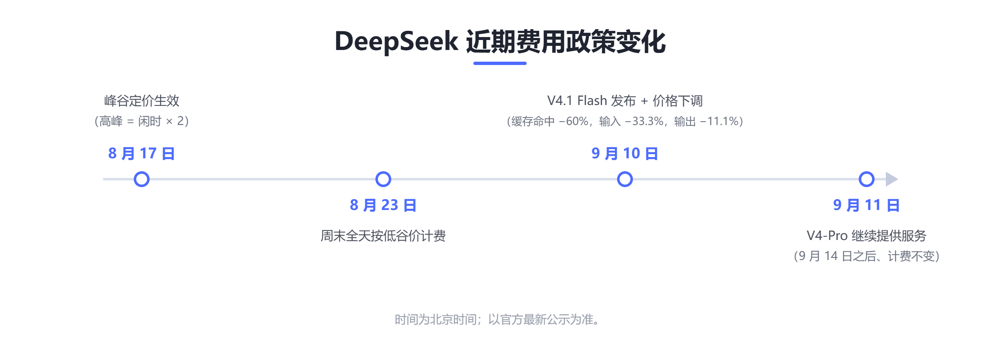
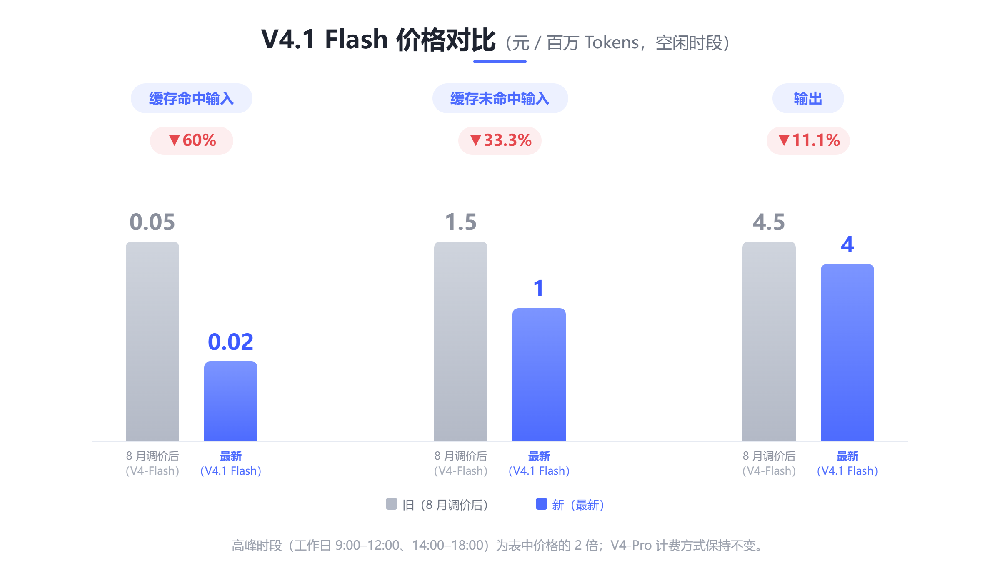

# DeepSeek V4.1 Flash 发布：更强、更快、更普惠，价格同步下调

> **导语**：9 月 10 日，DeepSeek 发布新模型 **V4.1 Flash** 并同步下调 API 价格；9 月 11 日，官方又宣布将在 9 月 14 日之后继续提供 V4-Pro 服务。最近一个月的模型与费用变化，一文帮你梳理。

## 一、V4.1 Flash 是什么

DeepSeek 官方发布说明的标题正是「DeepSeek V4.1 Flash：更强、更快、更普惠」。它是 DeepSeek 全新模型结构系列中**最小尺寸**的模型，核心规格如下：

· **552B 参数 MoE**，采用全新的 Causal-Encoder-Decoder 非对称结构——输入激活 8B、输出激活 16B，并配合新预训练方式与更大规模的强化学习后训练；

· **原生多模态**：可以直接理解图片、界面、图表、视觉文档；

· **1M tokens 上下文**，最大输出 384K tokens；

· 支持思考 / 非思考模式、工具调用、JSON Output、Responses API，兼容 OpenAI 与 Anthropic 接口格式。

对已有用户很友好的一点：API 模型名为 `deepseek-flash`，旧模型名 `deepseek-v4-flash`、`deepseek-v4-flash-vision-exp` 的请求将被暂时路由到 V4.1 Flash，不用改代码即可完成升级。

值得留意的是「非对称」这个设计：输入侧激活只有 8B，输出侧激活 16B。日常调用中，系统提示与上下文大多可以缓存复用，而输出每次都要全新生成——把更多算力集中在输出侧，配合下文提到的 KV Cache 压缩，正是「更强又更省」的关键。

## 二、成绩单：官方评测节选

DeepSeek 官方在发布说明中称，V4.1 Flash「成功超越了包括 DeepSeek V4 Pro 在内的一众旗舰模型的智能水平」。官方公布的基准成绩覆盖科学问答、数学、编程、终端操作与自动化任务，这里节选其中代表性项目：

· GPQA Diamond（研究生级科学问答）：**90.9**

· Humanity's Last Exam（HLE）：**36.8**（其中纯文本子集为 39.1）

· Codeforces Rating（编程竞赛评级）：**3471**

· MathArena Apex（数学推理竞技场）：**65.6**

· Terminal-Bench 2.1（终端任务）：**90.6**

· DeepSWE v1.1（软件工程基准）：**74.2**

· HLE（w/tools，工具辅助）：**63.9**

· Automation-Bench（自动化任务）：**54.8**

注：以上均为官方公布数据，实际表现仍与具体使用场景有关。

## 三、为什么更省：KV Cache 大幅压缩

「更普惠」的技术底气，来自 KV Cache 的大幅压缩。官方称，较上一代模型，V4.1 Flash 的 KV Cache 对 HBM 的需求降到 1/4、对 SSD 的需求降到 1/8；相对初代模型，已经缩小了 437 倍。

对长上下文与多轮对话场景，这意味着服务端的缓存成本显著下降——这部分成本优势，最终直接体现在官方定价上：本次降价幅度最大的一档，正是缓存命中价（0.05 降至 0.02）。

## 四、开源与生态

· 模型权重已在 Hugging Face 开源，仓库内同时提供完整技术报告；

· 腾讯 WorkBuddy、CodeBuddy 以及 OpenCode 已作为官方合作伙伴接入 V4.1 Flash。

## 五、费用政策变化：一条时间线

过去一个月，DeepSeek 的费用政策经历了几次调整，按时间线梳理如下。整体方向很明确：把高峰时段的部分流量引导到闲时，用户在低谷期享受半价，服务资源也得到更均衡的使用。

· **8 月 17 日**：峰谷定价正式生效。以 V4-Flash 为例，闲时价格为缓存命中 0.05、输入 1.5、输出 4.5（元/百万 tokens），高峰时段翻倍；V4-Pro 同步实行闲时 / 高峰两档定价——闲时 0.15 / 4.5 / 13.5、高峰 0.30 / 9 / 27，此后再未调整。

· **8 月 23 日**：周末（周六、周日）全天不再区分峰谷，统一按低谷价计费。

· **9 月 10 日**：V4.1 Flash 发布，价格同步下调，新价格见下文表格。

· **9 月 11 日**：官方宣布，**9 月 14 日之后继续提供** DeepSeek V4 Pro 的 API 调用服务，计费方式保持不变。此前官方曾计划自 9 月 14 日起将 V4-Pro 请求路由至 Flash 并有序下线，现已决定保留——V4-Pro 用户可以继续按原方式使用。

## 六、最新价格表

单位：元 / 百万 tokens：

| 模型 | 时段 | 输入（缓存命中） | 输入（缓存未命中） | 输出 |
|---|---|---|---|---|
| DeepSeek-V4.1-Flash（`deepseek-flash`） | 空闲 | 0.02 | 1 | 4 |
| DeepSeek-V4.1-Flash（`deepseek-flash`） | 高峰 | 0.04 | 2 | 8 |
| DeepSeek-V4-Pro（`deepseek-v4-pro`） | 空闲 | 0.15 | 4.5 | 13.5 |
| DeepSeek-V4-Pro（`deepseek-v4-pro`） | 高峰 | 0.30 | 9 | 27 |

高峰时段为北京时间**周一至周五 9:00–12:00、14:00–18:00**；其余时间（含周末全天）为空闲时段；空闲时段价格为高峰时段的一半。

简单解释一下「缓存命中」：多轮对话与 Agent 场景中，请求里与历史上下文重复的部分命中缓存，按第一列价格计费，远低于缓存未命中的输入价——对话越长、复用越多，省钱越明显。

对比 8 月调价后的价格，Flash 闲时价从 0.05 / 1.5 / 4.5 降至 0.02 / 1 / 4，降幅分别为 60%、33.3%、11.1%（高峰价同比例下调）：

> 注：价格与政策以官方最新公示为准。

小注：在知令中选择 **Deepseek-V4-Flash** 即可，已由最新的 V4.1 Flash 提供服务；价格为闲时 / 高峰两档、与官方对齐，实际以知令内显示为准。

## 七、小结：对用户的实际影响

最后，把变化落到日常使用上：

· **错峰使用更划算**：高峰时段集中在工作日 9:00–12:00、14:00–18:00，批量任务、离线生成等可安排在闲时或周末，价格只有高峰时段的一半；

· **缓存收益更大**：缓存命中价远低于缓存未命中输入价（Flash 为 0.02 对 1），多轮对话与 Agent 长期任务成本受益明显；

· **选型更清晰**：Flash 承担高频、轻量、大批量的日常任务；V4-Pro 继续提供，复杂推理与专业分析仍有高端选项。日常使用中，把多轮任务放在同一会话里复用上下文，缓存命中带来的节省通常比时段差价更可观。

一句话总结：模型更强了，价格更低了，需要留意的只剩时段。

---

**参考信息**

· DeepSeek 官方发布说明（V4.1 Flash）：https://api-docs.deepseek.com/zh-cn/news/news260910

· DeepSeek 官方模型与价格页（当前定价）：https://api-docs.deepseek.com/zh-cn/quick_start/pricing

· DeepSeek 官方更新日志：https://api-docs.deepseek.com/zh-cn/updates

· Hugging Face 模型权重与技术报告：https://huggingface.co/deepseek-ai/DeepSeek-V4.1-Flash

*注：模型价格、服务策略可能随官方公告调整，请以官方页面为准。*

#大模型 #DeepSeek #V4.1Flash #人工智能
