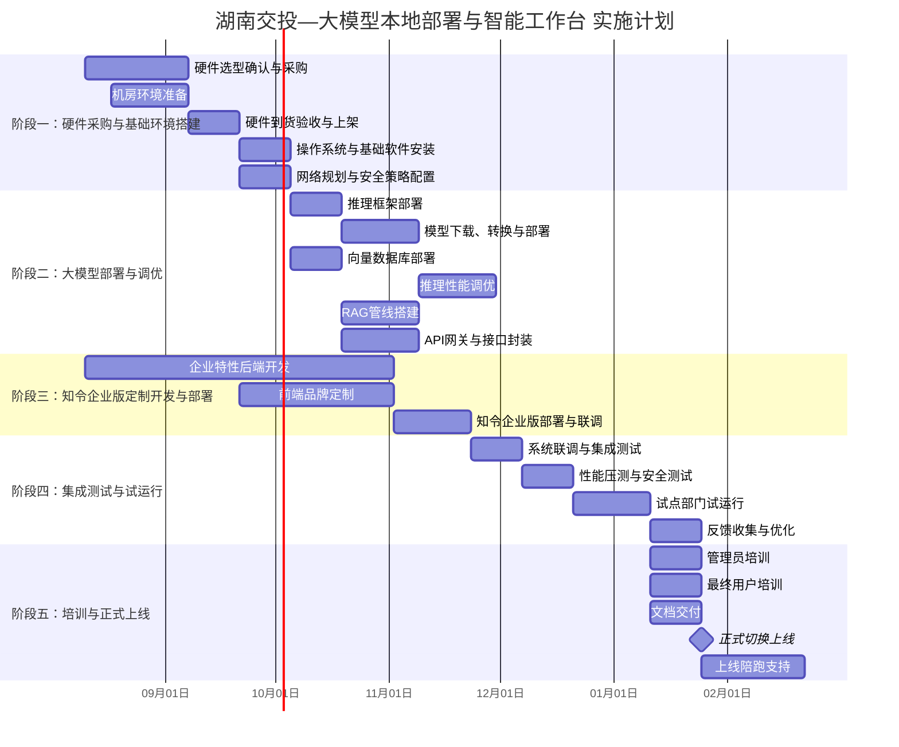
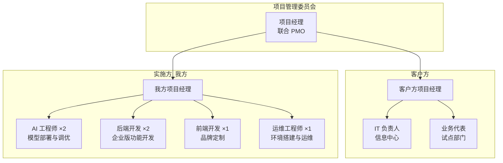

# 湖南交投集团 — 大模型本地部署与智能工作台 实施计划

> **项目名称**：湖南交投集团大模型本地部署与知令（ZHILING）智能工作台项目  
> **实施方**：西安禾成讴沃信息科技有限公司  
> **总工期**：约 6 个月  
> **编制日期**：2026 年 8 月 6 日  
> **文档版本**：v1.0（草案）

---

## 目录

1. [实施总体策略](#1-实施总体策略)
2. [项目阶段划分与时间线](#2-项目阶段划分与时间线)
3. [项目组织架构](#3-项目组织架构)
4. [风险管理](#4-风险管理)
5. [里程碑与交付物清单](#5-里程碑与交付物清单)
6. [验收标准](#6-验收标准)

---

## 1. 实施总体策略

本项目遵循以下三项核心策略，确保交付质量与项目可控：

### 1.1 分阶段交付，降低风险

将项目拆分为硬件采购、模型部署、软件开发、集成测试、培训上线五个阶段，每阶段设置明确的里程碑与交付物，实现「完成一阶段、验收一阶段、推进一阶段」的递进式交付。避免大包大揽的一次性交付模式，将技术风险与管理风险分散至各阶段。

### 1.2 硬件先行，软件跟进

大模型本地化部署高度依赖 GPU 算力基础设施，硬件供货周期（尤其是 NVIDIA H20/H100 等合规渠道 GPU）往往是项目关键路径。因此：

- **第 1 个月**即启动硬件选型确认与采购流程，锁定货源与交付排期；
- 硬件到货前，开发团队**在云端或自有开发环境中**并行启动知令企业版的功能开发，不阻塞软件进度；
- 硬件上架后，即刻进入模型部署调优阶段，实现硬件就绪与软件跟进的紧密衔接。

### 1.3 先试点后推广

正式上线前，选择 **1—2 个业务部门**（建议集团办公室、法务部或信息中心）作为试点用户，在真实业务场景中验证系统功能、性能与用户体验。基于试点反馈进行迭代优化后，再向全集团推广使用。此举可显著降低系统切换风险、提高用户接受度。

---

## 2. 项目阶段划分与时间线

项目总工期约 **6 个月**（26 周），划分为五个阶段。各阶段之间存在一定重叠窗口，以充分利用并行施工空间。

### 阶段一：硬件采购与基础环境搭建（第 1—2 月）

> 目标：完成 GPU 推理服务器、存储与网络设备的采购到货与基础环境搭建，为模型部署提供可用算力平台。

| 工作项 | 时间 | 内容说明 |
|--------|------|----------|
| **硬件选型确认与采购** | 第 1—4 周 | 根据调研报告推荐的「标准级」方案（4×NVIDIA H20 + 信创备选），与供应商确认报价、交付周期与 SLA；签署采购合同，启动采购流程 |
| **机房环境准备** | 第 2—4 周 | 确认机柜空间、供电（三相 32A/63A）、制冷能力（建议 PUE ≤ 1.25）与承重；必要时改造配电线路或加装精密空调 |
| **硬件到货验收与上架** | 第 5—6 周 | 服务器到货后逐台验收（GPU 型号、显存、SSD 健康状态），完成机柜上架、布线、通电自检 |
| **操作系统与基础软件安装** | 第 6—7 周 | 安装 Ubuntu Server 22.04 LTS / openEuler（信创节点）；配置 NVIDIA 驱动与 CUDA 工具链（兼容性矩阵验证）；部署 Docker + NVIDIA Container Toolkit；配置时间同步（NTP）与基础监控（Prometheus + Grafana + DCGM） |
| **网络规划与安全策略配置** | 第 6—7 周 | 规划管理网/业务网/存储网三网隔离；配置 100 GbE 高速存储网络（或 InfiniBand）；部署防火墙策略、VPN 接入；配置日志审计与堡垒机 |

**交付物**：

- 硬件到货验收报告（含序列号、配置明细）
- 服务器基础环境配置手册
- 网络拓扑图与安全策略文档

---

### 阶段二：大模型部署与调优（第 2—4 月）

> 目标：在硬件平台之上完成推理框架、大模型、向量数据库的全套部署，打通 RAG 管线，实现高性能推理服务。

| 工作项 | 时间 | 内容说明 |
|--------|------|----------|
| **推理框架部署（vLLM 集群）** | 第 5—6 周 | 部署 vLLM 推理引擎；配置张量并行（Tensor Parallelism）实现多 GPU 推理；部署 vLLM 集群模式（基于 Ray 分布式调度），支持多模型并行服务 |
| **模型下载、转换与部署** | 第 7—9 周 | 从 HuggingFace / ModelScope 下载 Qwen2.5-72B-Instruct（通用对话）、DeepSeek-R1-Distill-Qwen-32B/70B（深度推理）、Qwen2.5-Coder-32B（代码辅助）、BGE-M3（文档嵌入）等模型权重；将模型转换为 vLLM 兼容格式（AWQ/INT8 量化以优化显存与吞吐）；逐模型部署、启动推理服务并验证输出质量 |
| **向量数据库部署（Milvus / Qdrant）** | 第 5—7 周 | 部署 Milvus 分布式集群（或 Qdrant），配置 etcd + MinIO 存算分离；创建多 Collection 策略（按知识库类型划分）；配置索引参数（IVF_FLAT / HNSW），平衡召回率与检索速度 |
| **推理性能调优** | 第 9—12 周 | 实测各模型在目标硬件上的 TTFT（首 Token 延迟）、TPS（Token/秒）、并发吞吐；调整 KV Cache 配置、Batch Size、Max Model Len 等参数；INT8/BF16 精度下的推理质量对比验证（困惑度 / 中文基准）；输出性能基准报告 |
| **RAG 管线搭建** | 第 8—11 周 | 搭建文档解析管线（PDF/Word/扫描件 OCR 解析 + 智能分块）；对接 BGE-M3 嵌入服务与 Milvus 向量检索；实现「检索 → 重排序 → 上下文组装 → LLM 生成」完整链路；支持流式输出（SSE） |
| **接口封装与 API 网关部署** | 第 7—10 周 | 设计统一的 RESTful API 接口规范（兼容 OpenAI Chat Completions 格式）；部署 API 网关（Nginx / Kong / APISIX），统一鉴权、限流与路由；提供 API 文档（Swagger / OpenAPI 3.0） |

**交付物**：

- 模型部署配置清单（模型名、精度、GPU 分配、端口映射）
- 推理性能基准报告（TTFT、TPS、并发吞吐、延迟分布）
- RAG 管线技术方案与配置文档
- API 接口文档（OpenAPI 3.0）

---

### 阶段三：知令企业版定制开发与部署（第 3—5 月）

> 目标：基于知令（ZHILING）核心产品进行企业版功能开发与品牌定制，对接本地大模型 API，完成企业级智能工作台部署。

> **说明**：知令企业版开发工作自项目启动即并行推进，借助云端开发环境提前完成核心功能编码，待阶段二模型 API 就绪后即可切换到本地 API 进行联调。

| 工作项 | 时间 | 内容说明 |
|--------|------|----------|
| **统一认证与多用户管理** | 第 1—8 周 | 实现多用户注册/登录体系（支持用户名密码 + 企业 SSO）；对接客户 AD/LDAP 目录服务，实现组织架构同步与单点登录（SSO）；开发角色-权限管理模块（RBAC 模型），支持管理员、部门负责人、普通用户等多级角色 |
| **权限控制与数据隔离** | 第 3—10 周 | 实现会话级数据隔离（不同用户/部门之间对话不可见）；知识库按部门/角色设置访问权限；模型调用配额管理（按用户/部门分配 Token 额度） |
| **审计日志** | 第 5—10 周 | 实现全量操作审计日志：用户登录/登出、模型调用记录（含输入/输出摘要）、文件上传/下载、知识库操作；日志持久化存储，支持按时间、用户、操作类型检索与导出；对接客户 SIEM 系统（可选） |
| **企业知识库管理** | 第 6—12 周 | 开发知识库管理后台：文档批量上传、分类管理、索引状态监控；支持知识库的创建、更新、删除与权限分配；提供检索命中率统计与分析面板 |
| **运维监控面板** | 第 8—12 周 | 开发运维管理面板：GPU 使用率/显存/温度实时监控；模型推理 QPS、延迟 P50/P95/P99 趋势图；用户活跃度统计、Token 消耗趋势；系统告警配置（GPU 温度过高、推理延迟突增、磁盘空间不足） |
| **前端品牌定制** | 第 8—14 周 | 知令客户端 UI 品牌定制：替换 LOGO 与启动画面（交投集团 VI）；主题色定制（交投品牌色系）；登录页面定制（含交投标识与免责声明）；客户端打包（含企业预设配置，开箱即用） |
| **知令企业版部署与联调** | 第 14—17 周 | 在客户服务器部署知令企业版服务端；配置对接本地大模型 API 地址；配置 AD/LDAP 连接参数；全链路联调（用户登录 → 模型调用 → 审计记录） |

**交付物**：

- 知令企业版部署包（含服务端 + 客户端）
- 企业版功能清单与管理员配置手册
- 审计日志规范与接口说明
- 品牌定制客户端安装包

---

### 阶段四：集成测试与试运行（第 5—6 月）

> 目标：完成系统全链路集成测试、性能压测与安全测试，并在试点部门试运行后收集反馈进行优化。

| 工作项 | 时间 | 内容说明 |
|--------|------|----------|
| **系统联调与集成测试** | 第 17—18 周 | 端到端全流程测试：用户登录 → 创建会话 → 大模型对话（含流式输出）→ 知识库检索增强 → 审计日志记录；多用户并发场景测试；异常场景测试（模型服务宕机恢复、网络中断重连、GPU 显存溢出处理） |
| **性能压测** | 第 18—19 周 | 模拟目标并发用户数（50/100/200 并发）进行压力测试；测量首 Token 延迟（P50/P95/P99）、Token 生成速度、端到端响应时间；记录 GPU 利用率与显存占用，验证硬件规格是否满足实际需求；输出性能压测报告 |
| **安全测试** | 第 18—19 周 | 渗透测试（Web 应用漏洞扫描、API 鉴权绕过测试）；敏感数据泄露检测（日志中是否包含用户输入明文、Token 等）；依据等保三级要求逐项自查（身份鉴别、访问控制、安全审计、数据加密、剩余信息保护）；国密算法合规检查（SM2/SM3/SM4） |
| **试点运行** | 第 19—22 周 | 选择 1—2 个部门（建议集团办公室、法务部或信息中心）作为试点用户；部署知令客户端至试点用户电脑；提供试点期间的全程技术支持与使用指导；试点周期 2—3 周 |
| **反馈收集与优化** | 第 21—23 周 | 收集试点用户反馈（功能需求、体验问题、模型回答质量）；根据反馈进行系统优化与 Bug 修复；输出试点运行总结报告 |

**交付物**：

- 集成测试报告（含测试用例与通过率）
- 性能压测报告（含并发、延迟、吞吐数据）
- 安全测试报告（含渗透测试结果与整改情况）
- 试点运行总结报告

---

### 阶段五：培训与正式上线（第 6 月）

> 目标：完成管理员与最终用户的系统培训，交付全套操作文档，实现正式切换上线并提供上线后陪跑支持。

| 工作项 | 时间 | 内容说明 |
|--------|------|----------|
| **管理员培训** | 第 20—22 周 | 培训内容：服务器日常运维（GPU 监控、日志查看、服务启停）、模型管理（模型上下线、版本切换）、用户与权限管理、知识库管理、审计日志查阅；培训形式：现场授课 + 实操演练（1—2 天）；培训对象：信息中心运维人员（2—4 人） |
| **最终用户培训** | 第 21—23 周 | 培训内容：知令客户端安装与登录、多模型会话使用、知识库检索、文档分析功能、常见问题处理；培训形式：分批次现场培训（每批 1—2 小时）+ 录制培训视频供后续入职人员学习；培训对象：试点部门 + 首批推广部门用户 |
| **操作手册与 FAQ 文档交付** | 第 21—23 周 | 交付《系统运维手册》（面向管理员，含日常巡检、故障排查、备份恢复流程）、《用户操作手册》（面向最终用户，含功能使用指南与截图）、《常见问题 FAQ》；文档格式：PDF + 在线可检索版本 |
| **正式切换上线** | 第 23 周 | 确认所有上线条件满足（测试通过、培训完成、文档交付）；执行正式切换（DNS 切换 / 负载均衡配置）；全集团通知上线 |
| **上线陪跑支持** | 第 23—26 周 | 上线后 1 个月内，安排 1 名运维工程师 + 1 名技术支持驻场或远程 7×24 小时响应；收集上线后问题并快速修复；每周出具运行周报（含系统运行状态、用户活跃度、问题处理情况） |

**交付物**：

- 《系统运维手册》
- 《用户操作手册》
- 《常见问题 FAQ》
- 培训签到表与培训效果评估
- 上线后周报（4 期）

---

## 3. 项目组织架构

项目采用「客户方 + 实施方」联合项目组模式，确保沟通高效、决策迅速。

### 3.1 组织架构图

### 3.2 角色与职责

| 角色 | 归属方 | 人数 | 核心职责 |
|------|--------|------|----------|
| **项目经理** | 客户方 | 1 人 | 项目整体协调、资源配置、里程碑审批、验收签字 |
| **IT 负责人** | 客户方 | 1 人 | 机房与网络环境准备、服务器接收与上架配合、安全策略确认、运维交接 |
| **业务代表** | 客户方 | 1—2 人 | 试点场景定义、用户反馈收集、内部推广协调 |
| **项目经理** | 实施方 | 1 人 | 项目计划制定与跟踪、团队协调、周报与里程碑汇报、风险管理 |
| **AI 工程师** | 实施方 | 2 人 | 推理框架部署、模型部署与量化、推理性能调优、RAG 管线搭建、向量数据库部署 |
| **后端开发** | 实施方 | 2 人 | 知令企业版后端功能开发（认证、权限、审计、知识库管理）、API 对接、运维面板开发 |
| **前端开发** | 实施方 | 1 人 | 前端品牌定制（LOGO、主题色、登录页）、客户端打包与分发 |
| **运维工程师** | 实施方 | 1 人 | 操作系统安装、网络配置、安全加固、上线陪跑支持、运维文档编写 |

### 3.3 沟通机制

| 沟通类型 | 频次 | 参与人 | 形式 |
|----------|------|--------|------|
| 项目启动会 | 1 次（项目启动时） | 全体项目组成员 | 现场会议 |
| 周例会 | 每周一次 | 双方项目经理 + 技术骨干 | 线上会议 + 会议纪要 |
| 阶段评审会 | 每阶段结束时 | 项目管理委员会 | 现场/线上 + 评审报告 |
| 紧急沟通 | 随时 | 双方项目经理 | 电话 / 即时通讯 |

---

## 4. 风险管理

| 编号 | 风险项 | 影响等级 | 影响描述 | 应对措施 |
|------|--------|----------|----------|----------|
| **R1** | **GPU 供货延迟** | 🔴 高 | H20/H100 等合规渠道 GPU 交付周期不确定（常见 8—16 周），可能导致阶段二模型部署无法按时启动 | ① 项目启动首日即发起采购流程；② 提前确认 2—3 家备选供应商（含国产昇腾渠道）；③ 与供应商签订含交付违约金的 SLA；④ 备选方案：先使用 L40S/RTX 6000 Ada 搭建开发测试环境，待主力 GPU 到货后无缝切换 |
| **R2** | **模型性能不达预期** | 🟡 中 | 部署后实际推理吞吐、首 Token 延迟或中文回答质量低于 POC 预期，影响用户体验 | ① 阶段二预留充足的性能调优时间（3 周）；② 制定量化精度降级预案（BF16 → INT8 → INT4）；③ 预先建立中文基准测试集，逐模型验证；④ 备选方案：换用 Qwen2.5-32B（轻量化但中文能力仍强）作为主力模型 |
| **R3** | **用户接受度低** | 🟡 中 | 员工不习惯使用 AI 助手，试点使用率低，推广困难 | ① 选择对 AI 工具有需求的部门（如法务部合同审查、办公室公文起草）作为首批试点；② 在培训中准备与日常工作直接相关的实用案例（而非泛泛演示）；③ 试点期间安排「AI 使用大使」1 对 1 辅导；④ 收集典型成功案例，通过内部宣传提升认知 |
| **R4** | **异构硬件适配困难** | 🟡 中 | 华为昇腾 CANN 生态与 NVIDIA CUDA 存在差异，部分模型或算子需额外适配，导致信创节点部署延期 | ① 提前在昇腾开发环境中实测目标模型（Qwen2.5、BGE-M3）的推理兼容性；② 基于 vLLM-Ascend 社区分支部署，降低适配成本；③ 信创节点定位为「逐步切换」而非「首期主力」，为主流 NVIDIA 方案保留充足时间窗口；④ 预算中预留 15—20 人天用于 CANN 适配 |
| **R5** | **等保三级测评不通过** | 🔴 高 | 安全合规建设存在缺口（如国密算法未启用、审计日志不完整），导致测评延期或需返工整改 | ① 阶段一就将等保三级要求纳入安全策略设计（参照 GA/T 2380—2026 新规）；② 阶段四安全测试前，邀请等保测评机构进行预评估，提前发现并整改问题；③ 审计日志、数据加密、访问控制等功能从开发阶段即按合规要求实现；④ 预留 2—3 周整改缓冲期 |
| **R6** | **机房基础设施不满足 GPU 服务器要求** | 🟡 中 | 高密度 GPU 服务器功耗大（8 卡 H100 整机约 8—10 kW），现有机房供电/制冷/承重不足 | ① 阶段一初期由运维工程师现场勘查机房条件（供电容量、空调制冷量、机柜承重、UPS 续航）；② 根据勘查结果制定改造方案（加装精密空调、增容配电、加固机柜）；③ 若改造周期过长，考虑短期租赁 IDC 托管作为过渡方案 |
| **R7** | **开源模型许可证变更风险** | 🟢 低 | Qwen、DeepSeek 等模型未来可能更改开源许可协议，影响商用合规性 | ① 优先选择 Apache 2.0 / MIT 等宽松许可的模型版本；② 关注模型官方公告与社区动态，及时评估影响；③ 归档当前已授权版本的模型权重文件，确保可回退 |

---

## 5. 里程碑与交付物清单

| 阶段 | 里程碑 | 时间节点 | 交付物 | 验收标准 |
|------|--------|----------|--------|----------|
| **阶段一** | M1-1 硬件采购合同签署 | 第 4 周末 | 采购合同、供应商 SLA 承诺书 | 合同签订，交货期明确 |
| **阶段一** | M1-2 硬件到货验收通过 | 第 6 周末 | 硬件验收报告（含序列号、配置、健康状态） | 所有硬件与合同清单一致，通电自检通过 |
| **阶段一** | M1-3 基础环境就绪 | 第 8 周末 | 环境配置手册、网络拓扑图、安全策略文档 | OS 安装完成、网络可达、GPU 驱动正常加载 |
| **阶段二** | M2-1 推理框架部署完成 | 第 7 周末 | vLLM 集群部署配置文档 | vLLM 集群启动成功，测试推理请求正常返回 |
| **阶段二** | M2-2 模型全部部署上线 | 第 10 周末 | 模型部署清单（模型名、精度、GPU 分配） | 所有目标模型推理服务可用，输出质量经验证 |
| **阶段二** | M2-3 RAG 管线打通 | 第 12 周末 | RAG 管线技术文档 | 文档上传 → 检索 → 增强生成全链路可用 |
| **阶段二** | M2-4 性能调优完成 | 第 14 周末 | 推理性能基准报告 | TTFT / TPS / 并发吞吐达标 |
| **阶段二** | M2-5 API 网关就绪 | 第 12 周末 | API 接口文档（OpenAPI 3.0） | 统一鉴权、限流、路由功能正常 |
| **阶段三** | M3-1 企业版核心功能开发完成 | 第 12 周末 | 功能清单、测试用例 | 认证、权限、审计、知识库管理四大模块可用 |
| **阶段三** | M3-2 前端品牌定制完成 | 第 16 周末 | 品牌定制客户端安装包 | LOGO、主题色、登录页符合交投 VI 规范 |
| **阶段三** | M3-3 知令企业版部署完成 | 第 18 周末 | 部署包、管理员配置手册 | 服务端与客户端部署成功，对接本地大模型 API |
| **阶段四** | M4-1 集成测试通过 | 第 19 周末 | 集成测试报告 | 测试用例通过率 ≥ 95% |
| **阶段四** | M4-2 性能压测通过 | 第 20 周末 | 性能压测报告 | 目标并发下延迟与吞吐满足指标 |
| **阶段四** | M4-3 安全测试通过 | 第 20 周末 | 安全测试报告 | 无高危漏洞，等保三级自查通过 |
| **阶段四** | M4-4 试点运行完成 | 第 23 周末 | 试点运行总结报告 | 试点用户反馈收集完毕，关键问题已修复 |
| **阶段五** | M5-1 培训完成 | 第 24 周末 | 培训签到表、评估问卷、操作手册 | 管理员与用户培训覆盖率 100% |
| **阶段五** | M5-2 正式上线 | 第 24 周末 | 上线确认单（双方签字） | 系统切换完成，全集团可使用 |
| **阶段五** | M5-3 陪跑期结束 | 第 28 周末 | 陪跑期运行报告（4 期周报） | 系统稳定运行，问题响应 SLA 达标 |

---

## 6. 验收标准

### 6.1 功能性验收

| 序号 | 验收项 | 标准 |
|------|--------|------|
| F1 | 大模型对话 | 支持 Qwen2.5-72B、DeepSeek-R1 蒸馏版等多模型切换，对话质量达到预期 |
| F2 | RAG 检索增强 | 基于企业知识库的问答，检索命中率 ≥ 85%，答案引用来源可追溯 |
| F3 | 统一认证 | 支持 AD/LDAP 对接，用户可通过企业账号 SSO 登录 |
| F4 | 权限管理 | RBAC 权限生效，不同角色用户只能访问授权范围内的功能与知识库 |
| F5 | 审计日志 | 全量操作可追溯，支持按时间/用户/类型检索与导出 |
| F6 | 运维监控面板 | 实时展示 GPU 使用率、推理 QPS、用户活跃度等关键指标 |
| F7 | 品牌定制 | 客户端界面使用交投品牌 LOGO、主题色，登录页含交投标识 |

### 6.2 性能验收

| 序号 | 指标 | 标准 |
|------|------|------|
| P1 | 首 Token 延迟（TTFT） | P95 ≤ 3 秒（通用对话场景） |
| P2 | Token 生成速度 | ≥ 30 Token/秒（通用对话，单用户） |
| P3 | 并发用户数 | 支持 100 并发用户同时在线，推理服务不降级 |
| P4 | 系统可用性 | 上线后 1 个月陪跑期内可用性 ≥ 99.5% |

### 6.3 安全验收

| 序号 | 指标 | 标准 |
|------|------|------|
| S1 | 等保合规 | 满足等保三级基本要求（参照 GA/T 2380—2026） |
| S2 | 渗透测试 | 无高危漏洞，中危漏洞已修复或制定整改计划 |
| S3 | 数据安全 | 用户对话数据不出本地环境，日志不记录敏感明文 |

---

*本文档为实施计划草案，具体时间节点与里程碑将在项目启动会上与客户方共同确认后定稿。*
