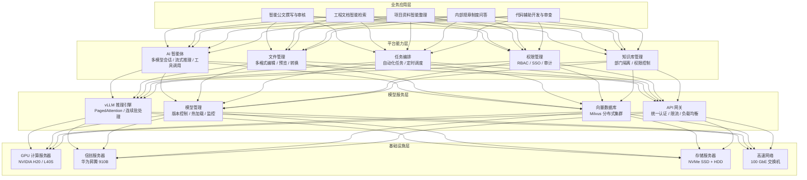

# 湖南交投集团 — 大模型本地部署与智能工作台 技术方案

> **项目名称**：湖南交投集团大模型本地部署与知令（ZHILING）智能工作台项目  
> **方案提供方**：西安禾成讴沃信息科技有限公司  
> **文档版本**：v1.0（最终稿）  
> **编制日期**：2026 年 8 月 7 日  
> **密级**：内部

---

## 目录

1. [项目概述](#1-项目概述)
2. [总体架构](#2-总体架构)
3. [大模型算力平台方案](#3-大模型算力平台方案)
   - 3.1 [硬件配置清单](#31-硬件配置清单)
   - 3.2 [模型选型与部署方案](#32-模型选型与部署方案)
   - 3.3 [推理框架与部署架构](#33-推理框架与部署架构)
   - 3.4 [RAG 知识库方案](#34-rag-知识库方案)
4. [知令企业版智能工作台方案](#4-知令企业版智能工作台方案)
   - 4.1 [知令现有产品能力](#41-知令现有产品能力)
   - 4.2 [企业版增强特性](#42-企业版增强特性)
   - 4.3 [典型应用场景](#43-典型应用场景)
5. [关键技术指标](#5-关键技术指标)

---

## 1. 项目概述

### 1.1 项目背景

湖南交投集团作为湖南省属大型国有企业，在高速公路投资建设、运营管理、交通基础设施建设等领域拥有庞大的业务体系和海量的工程文档、合同文件、规章制度、技术规范等信息资产。随着集团数字化转型升级的深入推进，传统办公模式下文档检索效率低、信息分散、知识沉淀困难等问题日益凸显，亟需引入人工智能技术提升办公智能化水平。

大语言模型（LLM）技术的快速发展为企业知识管理与智能办公带来了变革性机遇。通过将大模型本地化部署至集团内部数据中心，结合企业知识库构建智能工作平台，可为集团员工提供智能公文撰写、文档智能检索、制度问答、项目管理辅助等 AI 能力，在保障数据安全的前提下大幅提升工作效率与管理决策水平。

### 1.2 建设目标

1. **构建安全可控的大模型算力平台**：在集团数据中心部署 GPU 推理服务器集群，实现开源大模型的本地化私有部署，数据不出企业内网，满足《数据安全法》及等保三级合规要求。

2. **搭建企业级智能工作台**：基于知令（ZHILING）产品定制企业版智能工作台，集成统一认证、权限管理、审计追踪、品牌定制等企业级特性，为集团全员提供一站式的 AI 智能办公入口。

3. **建设企业知识库与 RAG 问答体系**：将集团工程文档、合同文件、规章制度、技术规范等非结构化数据转化为可检索、可问答的企业知识资产，实现"即问即答"的智能知识服务。

4. **赋能核心业务场景**：围绕智能公文撰写与审核、工程文档智能检索、项目资料智能整理、内部制度问答、代码辅助开发与安全审查等典型场景，实现 AI 能力与业务工作的深度融合。

### 1.3 方案总体思路

本方案遵循**"算力平台 + 模型服务 + 智能工作台 + 业务应用"四层架构**，以开源大模型为核心引擎，以知令企业版为应用载体，以企业知识库为数据基座，构建覆盖集团全员的智能办公平台。

在技术选型上，采用**"主流 NVIDIA GPU 为主、信创华为昇腾为辅"的双轨策略**，兼顾性能与合规；在模型选型上，采用**"通用对话 + 深度推理 + 代码辅助 + 嵌入检索"的多模型矩阵**，覆盖不同类型的业务需求；在部署运维上，遵循**"分阶段实施、先试点后推广"**的项目推进策略，降低风险、确保落地效果。

---

## 2. 总体架构

本方案采用四层分层架构，自底向上依次为基础设施层、模型服务层、平台能力层和业务应用层。各层职责分明、接口清晰，支持灵活扩展与持续演进。



**各层说明**：

| 层次 | 核心组件 | 职责 |
|------|---------|------|
| **基础设施层** | GPU 服务器、存储、网络、信创节点 | 提供算力、存储与网络基础资源，承载模型推理与数据存储 |
| **模型服务层** | vLLM 推理引擎、向量数据库、API 网关 | 提供高性能模型推理服务、向量检索能力及统一 API 出口 |
| **平台能力层** | 知令企业版核心功能模块 | 提供 AI 智能体、文件管理、任务编排、权限管控、知识库管理等平台级能力 |
| **业务应用层** | 面向业务场景的应用功能 | 将 AI 能力转化为具体业务场景中的生产力工具 |

---

## 3. 大模型算力平台方案

本章基于调研报告中推荐的**标准级方案（方案 B）**进行设计，总硬件预算约 **180—220 万元**（含硬件采购、信创试点、存储与网络设备），定位为生产级部署，可支撑 100—300 并发用户的日常使用，覆盖湖南交投集团主要 AI 办公场景。

### 3.1 硬件配置清单

#### 3.1.1 硬件总览

| 序号 | 设备类型 | 数量 | 核心配置 | 用途 |
|------|---------|------|----------|------|
| 1 | GPU 推理服务器（主） | 1 台 | 4×NVIDIA H20（96 GB HBM3） | Qwen2.5-72B 通用对话、DeepSeek-R1 蒸馏版深度推理 |
| 2 | GPU 推理/管理节点（辅） | 1 台 | 2×NVIDIA L40S（48 GB GDDR6） | Qwen2.5-Coder-32B 代码辅助、Qwen2-VL-7B 文档 OCR、BGE-M3 嵌入服务、模型管理 |
| 3 | 信创试点服务器（可选） | 1 台 | 2×华为昇腾 910B（40 GB HBM2e） | 信创路线试点，Qwen3-32B 昇腾版推理，为后续信创全面切换积累经验 |
| 4 | 存储服务器 | 1 台 | 8×7.68 TB NVMe SSD + 96 TB HDD | 模型权重存储、向量数据持久化、文档文件存储、日志归档 |
| 5 | 网络交换机 | 1 台 | 100 GbE / 25 GbE 混合 | 高速推理数据传输、管理网络、存储网络隔离 |
| 6 | 机柜/配电/散热 | 1 套 | 双机柜，液冷 + 强风冷，PUE ≤ 1.2 | 保障高密度 GPU 服务器的供电与散热 |

#### 3.1.2 详细配置

**（1）GPU 推理服务器（主）**

| 配置项 | 规格 | 数量 | 备注 |
|--------|------|------|------|
| GPU | NVIDIA H20，96 GB HBM3，FP16 算力约 148 TFLOPS，支持 NVLink | 4 卡 | 中国合规版，推理友好 |
| CPU | 2×Intel Xeon Platinum 8468（48 核，2.1 GHz）| 2 颗 | 高核心数支撑数据预处理与并发管理 |
| 内存 | 1 TB DDR5 ECC（4800 MT/s）| 16×64 GB | 大容量内存支撑 KV Cache |
| 系统盘 | 2×960 GB NVMe SSD（RAID 1）| — | 操作系统与基础软件 |
| 数据盘 | 4×7.68 TB NVMe SSD（RAID 10）| — | 模型权重加载、高速缓存 |
| 网络 | 100 GbE 双口（Mellanox ConnectX-7）+ 25 GbE 管理口 | — | 高速推理数据通信 |
| 电源 | 4000W 冗余电源（2+2）| — | 保障高功耗 GPU 稳定供电 |
| 散热 | 液冷或强风冷方案 | — | GPU TDP 约 300W/卡，4 卡总功耗约 1.2 kW |
| 机箱 | 4U 机架式 | — | — |

**（2）GPU 推理/管理节点（辅）**

| 配置项 | 规格 | 数量 | 备注 |
|--------|------|------|------|
| GPU | NVIDIA L40S，48 GB GDDR6，FP16 算力约 91 TFLOPS（FP8: 362）| 2 卡 | 推理、嵌入服务、微调 |
| CPU | 2×Intel Xeon Gold 5418Y（24 核，2.0 GHz）| 2 颗 | — |
| 内存 | 512 GB DDR5 ECC（4800 MT/s）| 8×64 GB | — |
| 系统盘 | 2×960 GB NVMe SSD（RAID 1）| — | — |
| 数据盘 | 2×3.84 TB NVMe SSD（RAID 1）| — | 嵌入模型、代码模型权重 |
| 网络 | 25 GbE 双口 | — | — |
| 电源 | 2000W 冗余电源（1+1）| — | — |
| 机箱 | 2U/4U 机架式 | — | — |

**（3）信创试点服务器（可选）**

| 配置项 | 规格 | 数量 | 备注 |
|--------|------|------|------|
| NPU | 华为昇腾 910B，40 GB HBM2e，FP16 算力 64 TFLOPS | 2 卡 | 信创目录产品 |
| CPU | 2×鲲鹏 920（48 核，ARM 架构）| 2 颗 | 信创生态全链路 |
| 内存 | 512 GB DDR4 ECC | — | — |
| 系统盘 | 2×960 GB NVMe SSD（RAID 1）| — | — |
| 存储 | 4×3.84 TB NVMe SSD | — | — |
| 网络 | 25 GbE 双口 | — | — |
| 操作系统 | openEuler 22.03 LTS / 麒麟 V10 | — | 信创 OS |

**（4）存储服务器**

| 配置项 | 规格 | 数量 | 备注 |
|--------|------|------|------|
| CPU | 2×Intel Xeon Silver 4410Y（12 核）| 2 颗 | — |
| 内存 | 256 GB DDR5 ECC | — | — |
| 系统盘 | 2×480 GB SSD（RAID 1）| — | — |
| NVMe 存储池 | 8×7.68 TB NVMe U.2 SSD | — | 模型权重、向量索引、热数据 |
| HDD 存储池 | 12×8 TB SATA HDD（RAID 6）| — | 文档归档、日志存储、备份 |
| 网络 | 100 GbE 双口 + 25 GbE 管理口 | — | — |
| RAID 卡 | 硬件 RAID，2 GB 缓存 + BBU | — | — |

**（5）网络交换机**

| 配置项 | 规格 | 数量 | 备注 |
|--------|------|------|------|
| 核心交换机 | 100 GbE L3 交换机，≥ 32 个 100G 端口 | 1 台 | 推理数据高速互联 |
| 接入交换机 | 25 GbE L2 交换机，≥ 48 个 25G 端口 | 1 台 | 管理网络、终端接入 |
| 防火墙 | 下一代防火墙（NGFW），吞吐 ≥ 10 Gbps | 1 台 | 安全隔离、入侵检测、VPN |

#### 3.1.3 硬件预算汇总

| 序号 | 设备 | 数量 | 单价（万元） | 小计（万元） |
|------|------|------|-------------|------------|
| 1 | GPU 推理服务器（主，4×H20） | 1 台 | 70—90 | 70—90 |
| 2 | GPU 推理/管理节点（2×L40S） | 1 台 | 20—25 | 20—25 |
| 3 | 信创试点服务器（2×昇腾 910B） | 1 台 | 20—25 | 20—25 |
| 4 | 存储服务器 | 1 台 | 10—15 | 10—15 |
| 5 | 网络设备（交换机 + 防火墙） | 1 套 | 10—15 | 10—15 |
| 6 | 机柜/配电/液冷 | 1 套 | 8—12 | 8—12 |
| **硬件合计** | | | | **138—182** |

> **注**：以上价格为 2026 年 Q3 市场参考价，实际采购以供应商正式报价为准。硬件预算中未包含软件授权、实施服务及运维费用，项目总体预算建议预留 180—220 万元以覆盖全周期成本。

### 3.2 模型选型与部署方案

#### 3.2.1 模型矩阵

基于湖南交投集团的典型业务场景（公文写作、制度问答、合同审查、工程文档检索、代码辅助等），本方案构建"**通用对话 + 深度推理 + 代码辅助 + 多模态 + 嵌入检索**"五维模型矩阵：

| 服务类型 | 模型 | 参数量 | 推理精度 | 显存需求 | GPU 分配 | 部署框架 |
|---------|------|--------|---------|----------|---------|---------|
| **通用对话（主力）** | Qwen2.5-72B-Instruct | 72B（Dense） | INT8 | ~72 GB | 1×H20（96 GB） | vLLM |
| **深度推理** | DeepSeek-R1-Distill-Qwen-32B | 32B（Dense） | Q4_K_M | ~20 GB | 1×H20（共享） | vLLM |
| **代码辅助** | Qwen2.5-Coder-32B-Instruct | 32B（Dense） | Q4_K_M | ~21 GB | 1×L40S（48 GB） | vLLM |
| **文档 OCR / 多模态** | Qwen2-VL-7B-Instruct | 7B | FP16 | ~14 GB | 1×L40S（共享） | vLLM |
| **文档嵌入（RAG）** | BGE-M3（BAAI） | — | FP16 | ~2.2 GB | 共享 H20 | 自建 / TEI |
| **重排序** | bge-reranker-v2-m3 | — | FP16 | ~2 GB | 共享 H20 | 自建 |
| **信创对话（试点）** | Qwen3-32B（昇腾版） | 32B | INT8 | ~20 GB | 2×昇腾 910B | MindIE |

#### 3.2.2 模型选型理由

**Qwen2.5-72B-Instruct（通用对话主力）**

- **核心优势**：Qwen 系列是当前**中文能力最强**的开源模型家族之一，Qwen2.5-72B 作为该系列最大规模的 Dense 模型，在中文理解、公文写作、知识问答等任务上表现优异，原生支持 128K 上下文窗口，可处理长篇合同、工程规范等长文档。
- **部署可行性**：INT8 量化后显存需求约 72 GB，单张 H20（96 GB）即可承载。若需 BF16 全精度推理，则需 2×H20（约 144 GB）通过张量并行部署。
- **许可合规**：Apache 2.0 许可证，商用友好。

**DeepSeek-R1-Distill-Qwen-32B（深度推理）**

- **核心优势**：DeepSeek-R1 蒸馏版继承满血版 R1 的强大推理链（Chain-of-Thought）能力，在逻辑推理、数学计算、合同条款分析等需要深度思考的场景中显著优于通用模型。32B 蒸馏版可在单张 H20 上高效运行（Q4 量化仅需约 20 GB）。
- **场景匹配**：适用于需要严谨推理的法务合同审查、工程概算核对、财务数据分析等任务。

**Qwen2.5-Coder-32B-Instruct（代码辅助）**

- **核心优势**：HumanEval 基准得分 92.7%，在代码生成、代码审查、Bug 修复等任务中表现卓越。对于交投集团信息中心的技术团队，可提供高效的代码辅助开发能力。
- **部署灵活**：Q4 量化后约 21 GB，单张 L40S（48 GB）即可承载，不挤占主对话模型的 H20 资源。

**BGE-M3（文档嵌入）**

- **核心优势**：BAAI 开源的旗舰嵌入模型，支持 100+ 语言，兼具 Dense、Sparse 与 ColBERT 三种检索模式，嵌入维度 1024，最大文本长度 8192。是多语言企业知识库建设的首选嵌入模型。
- **资源友好**：FP16 仅需约 2.2 GB 显存，可与主对话模型共享 GPU。

**Qwen3-32B 昇腾版（信创试点）**

- **战略意义**：在华为昇腾 910B 上部署 Qwen3-32B，为国企信创要求提供合规路径。通过试点积累昇腾平台的运维经验与性能基线，为后续可能的全面信创切换奠定基础。

#### 3.2.3 模型服务能力评估

| 指标 | 评估值 | 说明 |
|------|--------|------|
| 通用对话吞吐 | 100+ tok/s 每请求 | Qwen2.5-72B INT8 单卡推理 |
| 深度推理吞吐 | 50—80 tok/s 每请求 | DeepSeek-R1 蒸馏版 32B |
| 最大并发用户 | 100—200 | 通用对话场景，含请求排队与批处理 |
| 日处理问答量 | ~50 万次 | 基于平均每人每日 100—200 次问答估算 |
| RAG 文档容量 | 2000 万—5000 万文档块 | 每块约 512 token，总知识库约 100—250 GB |
| 响应延迟 | TTFT（首 Token 延迟）P95 < 2 秒 | — |

### 3.3 推理框架与部署架构

#### 3.3.1 推理框架选型

本方案选择 **vLLM** 作为主力推理引擎，理由如下：

| 维度 | vLLM | Ollama | llama.cpp |
|------|------|--------|-----------|
| **定位** | 生产级高吞吐推理服务 | 开发者友好，本地原型 | 极致性能，广泛硬件适配 |
| **连续批处理** | ✅ PagedAttention + Continuous Batching | ❌ | ❌ |
| **多 GPU 并行** | ✅ 张量并行 / 流水线并行 | ❌ | ❌ |
| **批处理吞吐** | **250+ tok/s**（10 并发） | 不支持 | 不支持 |
| **OpenAI 兼容 API** | ✅ 原生兼容 `/v1/chat/completions` | ✅ 原生 | ✅（llama-server） |
| **生产运维** | ✅ Prometheus 指标、Docker/K8s 部署 | 适合单机开发 | 适合边缘/CPU 场景 |
| **许可证** | Apache 2.0 | MIT | MIT |

**vLLM 核心特性**：

- **PagedAttention**：将 KV Cache 按页（Page）管理，类似操作系统虚拟内存，大幅减少显存碎片，提升批处理效率。相比传统方案（FasterTransformer），vLLM 在同等硬件下的吞吐量可提升至 **2—4 倍**。
- **连续批处理（Continuous Batching）**：动态合并到达的推理请求，无需等待整批请求完成即可插入新请求，显著提升 GPU 利用率和并发能力。
- **张量并行（Tensor Parallelism）**：支持跨多 GPU 拆分模型权重，实现超大模型（如 70B+）的高效推理。
- **量化支持**：原生支持 AWQ、GPTQ、INT8、FP8 等多种量化格式，灵活平衡推理精度与吞吐。

**信创平台**：华为昇腾 910B 使用 **MindIE**（华为官方推理引擎）部署，或通过 **vLLM-Ascend** 社区版实现与 NVIDIA 平台统一的运维体验。

#### 3.3.2 GPU 服务器互联拓扑

```mermaid
graph TB
    subgraph 管理网络（25 GbE）
        ADMIN[管理交换机<br/>25 GbE L2]
    end

    subgraph 推理高速网络（100 GbE）
        CORE[核心交换机<br/>100 GbE L3]
    end

    subgraph GPU推理服务器（主）[GPU 推理服务器（主）- 4U]
        GPU1[H20 #1<br/>96 GB HBM3]
        GPU2[H20 #2<br/>96 GB HBM3]
        GPU3[H20 #3<br/>96 GB HBM3]
        GPU4[H20 #4<br/>96 GB HBM3]
        GPU1 <-->|NVLink Bridge| GPU2
        GPU3 <-->|NVLink Bridge| GPU4
        GPU1 & GPU2 & GPU3 & GPU4 --- PCIE[PCIe Gen5 Switch]
        NIC1[100 GbE<br/>ConnectX-7]
        NIC2[25 GbE<br/>管理口]
        PCIE --- NIC1
        PCIE --- NIC2
    end

    subgraph GPU管理节点（辅）[GPU 管理节点（辅）- 2U]
        L40S_1[L40S #1<br/>48 GB GDDR6]
        L40S_2[L40S #2<br/>48 GB GDDR6]
        L40S_1 & L40S_2 --- PCIE2[PCIe Gen4 Switch]
        NIC3[25 GbE 双口]
        PCIE2 --- NIC3
    end

    subgraph 信创节点[信创试点服务器 - 2U]
        ASCEND1[昇腾 910B #1<br/>40 GB HBM2e]
        ASCEND2[昇腾 910B #2<br/>40 GB HBM2e]
        ASCEND1 <-->|HCCS 互联| ASCEND2
        ASCEND1 & ASCEND2 --- PCIE3[PCIe Gen4 Switch]
        NIC4[25 GbE 双口]
        PCIE3 --- NIC4
    end

    subgraph 存储节点[存储服务器 - 2U]
        STORAGE[NVMe Pool<br/>8×7.68 TB<br/>HDD Pool<br/>12×8 TB]
        NIC5[100 GbE<br/>+ 25 GbE]
        STORAGE --- NIC5
    end

    NIC1 -->|100 GbE 推理流量| CORE
    NIC5 -->|100 GbE 存储流量| CORE
    NIC2 & NIC3 & NIC4 -->|25 GbE 管理流量| ADMIN
    NIC5 -->|25 GbE 管理流量| ADMIN

    ADMIN -->|管理接入| FW[防火墙 / NGFW]
    FW -->|VPN / 内网| USERS[客户端用户]

    CORE -->|内部路由| FW
```

**互联说明**：

- **100 GbE 高速网络**：承载模型推理请求/响应、向量检索数据传输、存储读写。GPU 推理服务器（主）和存储服务器通过 100 GbE 直连核心交换机，保障低延迟、高带宽的数据通路。
- **25 GbE 管理网络**：承载服务器运维管理（SSH、监控指标采集）、用户客户端接入（经由防火墙 NAT/VPN）。
- **NVLink Bridge**：H20 服务器内部，每 2 张 GPU 通过 NVLink Bridge 互联（双向带宽 900 GB/s），用于张量并行场景下的 GPU 间高速通信。
- **HCCS 互联**：华为昇腾 910B 通过 HCCS（Huawei Cache Coherence System）实现卡间高速互联，支持双卡模型并行推理。
- **网络隔离**：管理网、业务网、存储网三网逻辑隔离，防火墙策略控制跨网访问。

#### 3.3.3 模型部署架构

```
                     ┌──────────────────────────────────────┐
                     │           API 网关（Nginx/Kong）        │
                     │   统一认证 · 限流 · 路由 · 负载均衡      │
                     └────────────────┬─────────────────────┘
                                      │
          ┌───────────────────────────┼───────────────────────────┐
          │                           │                           │
          ▼                           ▼                           ▼
┌──────────────────┐     ┌──────────────────┐     ┌──────────────────┐
│   vLLM 实例 #1   │     │   vLLM 实例 #2   │     │   vLLM 实例 #3   │
│ Qwen2.5-72B      │     │ DeepSeek-R1-32B  │     │ Qwen2.5-Coder-32B│
│ INT8 · 1×H20     │     │ Q4_K_M · 1×H20   │     │ Q4_K_M · 1×L40S  │
│ Port: 8001       │     │ Port: 8002       │     │ Port: 8003       │
└──────────────────┘     └──────────────────┘     └──────────────────┘
          │                           │                           │
          └───────────────────────────┼───────────────────────────┘
                                      │
          ┌───────────────────────────┼───────────────────────────┐
          │                           │                           │
          ▼                           ▼                           ▼
┌──────────────────┐     ┌──────────────────┐     ┌──────────────────┐
│   BGE-M3 嵌入    │     │  Reranker 服务   │     │  Qwen2-VL-7B    │
│   FP16 · 共享H20 │     │  FP16 · 共享H20  │     │  FP16 · 共享L40S│
│   Port: 8100     │     │  Port: 8101      │     │  Port: 8004      │
└──────────────────┘     └──────────────────┘     └──────────────────┘
                                      │
                                      ▼
                     ┌──────────────────────────────────────┐
                     │        Milvus 向量数据库集群           │
                     │    etcd + MinIO 存算分离 · 混合检索    │
                     └──────────────────────────────────────┘
```

#### 3.3.4 API 网关设计

API 网关作为所有模型服务的统一入口，承担以下核心职能：

| 功能 | 实现方案 | 说明 |
|------|---------|------|
| **统一鉴权** | JWT Token + API Key 双重机制 | 知令客户端使用 JWT（与 SSO 绑定），外部系统调用使用 API Key |
| **请求路由** | 基于模型名称的路由规则 | 根据请求中的 `model` 字段自动路由到对应的 vLLM 实例 |
| **速率限制** | 令牌桶算法，按用户/部门分级 | 普通用户 60 req/min，VIP 用户 120 req/min |
| **负载均衡** | 最小连接数算法 | 当同一模型部署多个实例时，将请求分发至负载最低的实例 |
| **请求/响应日志** | 异步写入 Elasticsearch | 全量记录请求元数据（不含对话明文），支撑审计与用量统计 |
| **安全防护** | IP 白名单 + 输入长度限制 + SQL 注入/XSS 过滤 | 前置防护层，仅允许内网 IP 访问推理服务 |

API 接口遵循 **OpenAI Chat Completions API 规范**（`/v1/chat/completions`），支持流式输出（SSE），确保与知令客户端及各类第三方工具的无缝对接。

### 3.4 RAG 知识库方案

#### 3.4.1 向量数据库选型

选择 **Milvus** 分布式向量数据库作为企业知识库的核心检索引擎：

| 维度 | Milvus | Qdrant | Chroma |
|------|--------|--------|--------|
| **适用规模** | 亿级以上 | 千万级 | <200 万 |
| **部署模式** | 分布式集群（Proxy/Query Node/Data Node/Index Node） | 单机/集群 | 单机嵌入 |
| **混合检索** | ✅ 稠密向量 + 稀疏向量（BM25）+ 标量过滤 | ✅ 稠密 + 标量 | ❌ 仅稠密 |
| **索引算法** | IVF_FLAT / IVF_PQ / HNSW / DiskANN | HNSW | HNSW |
| **存算分离** | ✅ etcd + MinIO / S3 | ❌ 存算一体 | ❌ |
| **GPU 加速** | ✅ RAFT 索引构建 | ❌ | ❌ |
| **多租户** | ✅ Collection / Partition 级别隔离 | ✅ Collection | ❌ |

**推荐理由**：

- **规模适配**：交投集团数十万份工程文档、合同、制度文件经分块后预计产生 2000 万—5000 万文档块，Milvus 的分布式架构可从容应对此量级，并支持未来扩展至亿级。
- **混合检索**：Milvus 原生支持稠密向量（语义相似度）+ 稀疏向量（关键词匹配 BM25）+ 标量过滤（部门、密级、时间等元数据）的混合检索，在交投场景中可兼顾语义理解与精确匹配。
- **多租户隔离**：通过 Partition Key 按部门/知识库维度实现数据隔离，确保不同部门只能检索到自己权限范围内的文档。
- **社区生态**：CNCF 毕业项目，与 LangChain/LlamaIndex 等主流框架深度集成，社区活跃、文档完善。

#### 3.4.2 文档处理管线

```
┌──────────┐    ┌──────────────┐    ┌──────────────┐    ┌──────────────┐    ┌──────────┐
│ 文档导入  │───▶│  格式解析     │───▶│  文本分块     │───▶│  向量化       │───▶│ 入库索引  │
│          │    │              │    │              │    │              │    │          │
│ PDF      │    │ MinerU /     │    │ 固定长度分块  │    │ BGE-M3       │    │ Milvus   │
│ DOCX     │    │ Unstructured │    │ 512 token/块  │    │ 1024 维      │    │ Insert   │
│ XLSX     │    │ PyMuPDF      │    │ 重叠 50 token │    │              │    │          │
│ PPTX     │    │ python-docx  │    │              │    │              │    │          │
│ TXT/MD   │    │              │    │              │    │              │    │          │
└──────────┘    └──────────────┘    └──────────────┘    └──────────────┘    └──────────┘
```

**各环节说明**：

1. **文档导入**：支持批量上传（Web 管理后台 / API），自动检测文件格式与编码，支持文件夹层级结构导入以保留文档组织关系。
2. **格式解析**：
   - PDF 文档：MinerU / PyMuPDF 解析，支持文字型 PDF 提取 + 扫描件 OCR 识别（集成 PaddleOCR）；
   - Office 文档：python-docx（DOCX）、openpyxl（XLSX）、python-pptx（PPTX）提取文本、表格与结构化信息；
   - 纯文本/Markdown：保留原格式的 Markdown 结构信息（标题层级、列表、代码块），提升检索精准度。
3. **文本分块**：
   - 默认分块策略：512 token/块，块间重叠 50 token，避免关键信息在分块边界处被截断；
   - 支持按文档类型定制分块策略（如合同类文档按条款分块、规范类文档按章节分块）。
4. **向量化**：调用 BGE-M3 嵌入服务将文本块转化为 1024 维向量，支持批量并行处理。
5. **入库索引**：向量 + 元数据（文档来源、部门归属、密级、时间戳等）一并写入 Milvus，构建 HNSW 索引。

#### 3.4.3 检索增强问答流程

```
用户提问 ──▶①──▶ BGE-M3 向量化 ──▶②──▶ Milvus 向量检索（Top-K=50）
                                              │
                                              ▼
                                        ③ 元数据过滤
                                    （部门权限 + 密级过滤）
                                              │
                                              ▼
                                   ④ bge-reranker-v2-m3 重排序
                                        （精排 Top-K=10）
                                              │
                                              ▼
                              ⑤ LLM 生成（Qwen2.5-72B）
                         System Prompt: "基于以下参考资料回答..."
                         Context: [检索到的文档块]
                         User Question: [用户原始问题]
                                              │
                                              ▼
                              ⑥ 流式输出回答 + 引用来源标注
```

**流程详解**：

1. **向量化**：用户问题通过 BGE-M3 转化为 1024 维查询向量。
2. **粗排检索**：在 Milvus 中执行 ANN（近似最近邻）检索，召回 Top-50 最相关文档块，延迟 < 50 ms。
3. **权限过滤**：在检索结果中注入用户所属部门、安全密级等标量过滤条件，剔除用户无权访问的文档块。
4. **精排重排序**：通过 bge-reranker-v2-m3 对 Top-50 结果进行交叉编码（Cross-Encoder）重排序，选取 Top-10 最相关文档块作为上下文，显著提升最终回答的准确性。
5. **增强生成**：将 Top-10 文档块拼接为上下文，结合精心设计的 System Prompt（包含"基于参考资料回答""不确定时请说明""标注引用来源"等指令），交由 Qwen2.5-72B 生成最终回答。
6. **流式输出**：回答以 SSE 流式返回至知令客户端，实现逐字展示的用户体验，回答末尾附引用来源（文档名称 + 页码/段落）。

---

## 4. 知令企业版智能工作台方案

### 4.1 知令现有产品能力

知令（ZHILING）是由西安禾成讴沃信息科技有限公司自主研发的全流程智能工作平台，面向科研与工程场景，支持 Windows、macOS、Linux 桌面端与 Android、iOS 移动端多端无缝协同。产品深度整合 DeepSeek、GLM、Qwen 等国产开源大模型，通过 Prompt 工程、工具链编排与上下文管理等全链路优化，为用户提供一站式 AI 智能办公体验。

#### 4.1.1 核心功能矩阵

| 模块 | 能力说明 |
|------|---------|
| **AI 智能体** | 多模型会话（支持 DeepSeek V4 / GLM-5.x / Qwen / Kimi K2.x 等主流模型）、流式推理与思维链展示、工具调用（Tool Calls）、子会话自治、多智能体圆桌协同、GUI 桌面自动化、多模态图片理解 |
| **文件与项目** | 本地/远程（SSH）项目管理、文件树浏览与操作、Monaco 代码编辑器（语法高亮 / 行内补全）、富文本编辑器（Slate/Lexical）、DOCX/PDF/XLSX/PPTX/Markdown 多格式预览与编辑、SVG 双模式查看（源码 + 安全预览）、MD→DOCX / XLSX→PDF 格式转换 |
| **终端与远程** | 本地 PTY 终端、SSH 远程终端、WSL 直连、SSH 连接池统一管理、远程文件管理、远程命令执行 |
| **计算任务** | `.task` 文件定义计算任务、SLURM / PBS 集群调度对接、本地/远程任务提交与状态轮询、群控批量操作 |
| **自动任务** | 定时调度（cron / interval / daily / weekly / once）、邮件事件触发（收到新邮件时自动执行）、计划书驱动的全流程自动编排 |
| **邮箱集成** | IMAP/SMTP 多账户邮箱管理、Agent 邮件工具（收发/回复/附件下载）、邮件持久化存储与检索 |
| **知识库** | 知识库浏览与管理 |
| **数据可视化** | Plotly 交互式图表、Mermaid 流程图/时序图/甘特图、D3 自定义图表、KaTeX 数学公式渲染 |
| **多平台支持** | **桌面端**：Windows（NSIS 安装包）、macOS（Apple Silicon arm64 DMG）、麒麟 V10（Linux AppImage）；**移动端**：Android / iOS（Expo + React Native） |

#### 4.1.2 技术架构概览

知令桌面端基于 **Electron 40 + React 19 + Vite 7 + MUI 7** 架构，采用前后端分离设计：

- **front_ui**：React 前端应用，负责 UI 渲染与用户交互，集成 Monaco 编辑器、Slate 富文本编辑器、xterm 终端、KaTeX/Mermaid/D3 渲染等组件；
- **back_frame**：Electron 主进程 + Express + Node Workers，负责进程管理、IPC 通信、SSH 连接管理、文件系统操作、本地终端等系统级能力；
- **服务端**：Django DRF + Channels/Daphne ASGI + Gunicorn，Nginx 反向代理，MySQL RDS，Redis Channel Layer，提供用户认证、会话存储、模型定价计费、移动端同步等后端服务。

知令的**本地优先安全架构**确保敏感数据可完全保留在用户本地环境与企业内网中，模型调用日志、对话内容、文件数据均不打穿企业防火墙，从根本上满足大型国企对数据安全与合规管理的严格需求。

### 4.2 企业版增强特性

为满足湖南交投集团作为大型国企的企业级管理需求，在知令现有产品能力基础上，定制开发以下企业版增强特性：

#### 4.2.1 统一身份认证与单点登录（SSO）

| 特性 | 实现方案 |
|------|---------|
| **企业账号体系** | 支持企业自有账号体系注册登录，支持用户名/密码 + 短信验证码双因子认证 |
| **AD/LDAP 对接** | 对接集团现有的 Active Directory 或 LDAP 目录服务，实现组织架构自动同步（部门、岗位、上下级关系） |
| **SSO 单点登录** | 基于 SAML 2.0 / OAuth 2.0 / CAS 协议，与集团统一认证平台集成，员工使用企业账号一次登录即可访问知令智能工作台 |
| **会话管理** | 支持会话超时策略配置、强制登出、异地登录检测与告警 |

#### 4.2.2 多用户管理与角色权限（RBAC）

采用**三级角色模型**，实现精细化权限管控：

| 角色 | 权限范围 |
|------|---------|
| **系统管理员** | 全局配置管理、用户管理、模型管理、审计日志查看、知识库全局管理 |
| **部门管理员** | 本部门用户管理、本部门知识库管理、本部门用量统计查看 |
| **普通用户** | AI 对话、文件操作、知识库检索（受部门与密级限制）、个人用量查看 |

**权限控制维度**：

- **功能权限**：控制用户可使用的功能模块（如是否允许创建自动任务、是否允许 SSH 远程连接等）；
- **数据权限**：按部门与密级隔离知识库检索结果，不同部门/不同密级的用户只能检索到授权范围内的文档；
- **模型权限**：控制用户可调用的大模型（如普通用户仅可用通用对话模型，高级用户可用深度推理模型）；
- **配额管理**：按用户/部门分配 Token 调用额度，超出配额后自动限流。

#### 4.2.3 模型使用审计与用量统计

| 功能 | 说明 |
|------|------|
| **全量操作审计** | 记录用户登录/登出、模型调用（含模型名称、输入 Token 数、输出 Token 数、时间戳）、文件上传/下载、知识库检索等全量操作日志 |
| **敏感信息脱敏** | 审计日志中对用户对话明文、密码、Token 等敏感信息自动脱敏处理，仅保留操作元数据 |
| **多维度统计** | 按用户 / 部门 / 模型 / 时间维度统计 Token 消耗、调用次数、活跃用户数等指标 |
| **可视化报表** | 提供管理后台可视化仪表盘，展示用量趋势图、Top-N 用户排行、模型使用分布等 |
| **日志导出** | 支持审计日志按条件检索与导出（CSV/Excel），可对接集团 SIEM 系统 |

#### 4.2.4 企业知识库管理

| 功能 | 说明 |
|------|------|
| **知识库创建与管理** | 支持创建多个知识库（如集团制度库、工程技术库、合同档案库等），每个知识库独立配置索引参数 |
| **部门级隔离** | 知识库按部门设置访问权限，部门 A 的用户无法检索部门 B 的知识库内容（除非获得授权） |
| **密级标签** | 文档入库时标注密级标签（公开 / 内部 / 机密），检索时根据用户密级自动过滤 |
| **批量导入** | Web 管理后台支持文档批量上传（拖拽上传 / 文件夹导入），自动触发文档处理管线 |
| **索引状态监控** | 实时查看知识库索引状态（文档总数、已索引数、索引进度、最近更新时间） |
| **检索命中率统计** | 统计知识库检索命中率与用户反馈（有用/无用），辅助优化分块策略与索引参数 |

#### 4.2.5 数据安全管控

| 安全层面 | 管控措施 |
|---------|---------|
| **传输安全** | 全链路 TLS 1.3 加密，知令客户端 ↔ 网关 ↔ 模型服务全部加密通信 |
| **存储安全** | 敏感配置（数据库密码、API Key）使用 AES-256 加密存储；模型权重文件存储于隔离存储池 |
| **国密合规** | 支持 SM2/SM3/SM4 国密算法套件，满足等保三级与信创合规要求 |
| **内容安全** | 输入侧敏感词过滤（政治敏感、涉密信息）、输出侧合规审查，阻断不合规内容 |
| **操作日志** | 全量操作日志（脱敏后）持久化存储，保留期 ≥ 6 个月，支持审计追溯 |
| **网络隔离** | 模型推理服务部署于隔离 VLAN，仅允许内网 API 网关通过白名单 IP 访问 |
| **数据不出境** | 所有模型推理、数据存储均在集团本地数据中心完成，数据 100% 不出内网 |

#### 4.2.6 企业级运维监控面板

| 监控维度 | 关键指标 |
|---------|---------|
| **GPU 资源监控** | GPU 利用率（%）、显存占用（GB / %）、GPU 温度（℃）、功耗（W），基于 NVIDIA DCGM + Prometheus + Grafana |
| **模型服务监控** | 模型推理 QPS、首 Token 延迟（P50/P95/P99）、Token 生成速度、请求成功率、错误率 |
| **用户活跃度** | 日活用户数（DAU）、月活用户数（MAU）、各时段在线人数趋势 |
| **Token 消耗** | 按模型/部门/用户维度的 Token 消耗趋势与配额使用率 |
| **系统告警** | 可配置告警规则：GPU 温度 > 85℃、显存使用率 > 95%、推理延迟 P95 > 5s、磁盘使用率 > 90%、模型服务宕机 |

#### 4.2.7 客户端品牌定制

| 定制项 | 说明 |
|--------|------|
| **LOGO 替换** | 客户端启动画面、主界面左上角、系统托盘图标替换为湖南交投集团 VI 标识 |
| **主题色定制** | 客户端整体 UI 主题色替换为交投集团品牌色系 |
| **登录页定制** | 登录页面嵌入交投集团标识、系统名称与免责声明 |
| **企业预设配置** | 客户端安装包预置企业服务器地址、默认模型、知识库列表，员工安装后开箱即用 |
| **客户端打包** | 提供 Windows 客户端安装包（支持静默安装 + 组策略分发），macOS DMG 及麒麟 V10 AppImage |

### 4.3 典型应用场景

#### 4.3.1 智能公文撰写与审核辅助

**场景描述**：集团办公室每日需撰写大量通知、报告、会议纪要等公文，格式要求严格（遵循《党政机关公文格式》GB/T 9704），撰写耗时且易出错。

**AI 赋能方式**：

- **公文模板生成**：用户输入简要指令（如"拟一则关于安全生产检查的通知"），大模型自动生成符合公文格式规范的完整初稿，含标题、主送机关、正文、落款等要素。
- **公文智能润色**：对已有公文进行语言润色（去口语化、规范用词）、结构调整、格式校对。
- **多版本对比**：将修改前后的公文并列展示，高亮差异，辅助审核人员快速定位变更内容。
- **法规引用校验**：结合企业知识库中的法规制度库，自动检查公文中引用的法规条款是否现行有效。

#### 4.3.2 工程文档智能检索与问答

**场景描述**：高速公路建设项目涉及海量工程文档（设计图纸说明、施工方案、监理报告、竣工验收文件等），传统检索方式需逐份翻阅，效率极低。

**AI 赋能方式**：

- **自然语言检索**：用自然语言提问（如"某高速 K12+300 段桥梁桩基设计参数"），系统从数千份工程文档中精准检索相关内容并生成摘要回答。
- **跨文档关联分析**：自动关联同一项目不同阶段的文档（如设计方案 ↔ 施工记录 ↔ 监理报告），构建项目文档知识图谱。
- **专业术语理解**：大模型经过交通行业语料适配，能准确理解"压实度""弯沉值""CBR"等工程专业术语。

#### 4.3.3 项目资料智能整理与分析

**场景描述**：集团每年管理数十个在建项目，项目经理需整理项目周报、月报，汇总投资进度、工程进度、质量安全等数据，工作量大且格式不一。

**AI 赋能方式**：

- **资料自动归集**：上传项目散落的文档（会议记录、工作日志、影像资料等），AI 自动识别文档类型并按项目/时间/类别归档。
- **智能摘要生成**：输入多份项目文件，AI 自动提炼关键信息，生成结构化的项目周报/月报摘要。
- **数据提取与统计**：从合同、报表等结构化/半结构化文档中提取关键数据（投资额、工程量、进度百分比），自动生成统计表格与趋势图表。

#### 4.3.4 内部规章制度问答

**场景描述**：集团拥有数百份内部规章制度（人事、财务、安全、党务等），员工在需要了解某项规定时，往往不知该查阅哪份文件或向哪个部门咨询。

**AI 赋能方式**：

- **制度知识库**：将所有内部规章制度导入 RAG 知识库，员工用自然语言提问（如"带薪年假怎么申请？""差旅费报销标准是多少？"），AI 即时给出准确回答并标注制度来源。
- **制度冲突检测**：当多份制度对同一事项规定不一致时，AI 可提示潜在冲突并建议以最新颁布文件为准。
- **新员工指引**：新入职员工通过与 AI 对话快速了解集团组织架构、考勤制度、报销流程等基本信息，降低 HR 部门重复咨询负担。

#### 4.3.5 代码辅助开发与安全审查

**场景描述**：集团信息中心负责业务系统的开发与运维，涉及 Java/C#/Python 等多语言开发、数据库管理与系统集成。

**AI 赋能方式**：

- **代码生成与补全**：开发人员在知令中描述需求，Qwen2.5-Coder-32B 自动生成符合规范的代码片段或完整函数。
- **代码审查**：提交代码至 AI 进行安全审查，检测 SQL 注入、XSS、硬编码密码等常见安全漏洞。
- **技术文档生成**：根据代码自动生成 API 文档、数据库 Schema 说明、部署运维手册。
- **Bug 定位辅助**：粘贴报错日志，AI 分析可能原因并给出修复建议。

---

## 5. 关键技术指标

### 5.1 性能指标

| 指标 | 目标值 | 说明 |
|------|--------|------|
| **并发用户数** | 100—300 人 | 100 人同时在线稳定使用，300 人峰值可降级运行 |
| **首 Token 延迟（TTFT）** | P95 < 3 秒（通用对话） | 从用户发送消息到收到第一个 Token 的延迟；简单问答 < 1 秒 |
| **Token 生成速度** | ≥ 100 tok/s（Qwen2.5-72B INT8，单请求） | 保障流式输出体验流畅 |
| **批处理吞吐** | ≥ 250 tok/s（10 并发） | vLLM 连续批处理模式下的总吞吐量 |
| **RAG 检索延迟** | < 500 ms（向量检索 + 重排序） | 从用户提问到返回增强上下文的端到端延迟 |
| **系统可用性** | ≥ 99.5%（月维度） | 不含计划内维护窗口（每月 ≤ 4 小时） |
| **模型加载时间** | < 5 分钟（模型冷启动） | 模型服务重启后恢复到可服务状态的时间 |

### 5.2 容量指标

| 指标 | 目标值 | 说明 |
|------|--------|------|
| **日处理问答量** | ~50 万次 | 基于人均 100—200 次/天 × 300 用户估算 |
| **知识库文档容量** | 2000 万—5000 万文档块 | 每块约 512 token，总知识库约 100—250 GB 向量数据 |
| **支持文档格式** | PDF / DOCX / XLSX / PPTX / TXT / Markdown | 知识库文档解析支持的全部格式 |
| **单次对话上下文** | 128K token | Qwen2.5-72B 原生上下文窗口，可处理约 10 万字的长文档 |
| **日志保留期** | ≥ 6 个月（在线）+ ≥ 3 年（归档） | 审计日志存储策略 |

### 5.3 安全合规指标

| 指标 | 目标值 | 说明 |
|------|--------|------|
| **等保合规等级** | 等保三级 | 满足《网络安全等级保护基本要求》三级标准 |
| **国密算法支持** | SM2 / SM3 / SM4 | 满足 GA/T 2380—2026 新规要求 |
| **数据传输加密** | TLS 1.3 | 全链路加密通信 |
| **数据存储加密** | AES-256 | 敏感配置与日志加密存储 |
| **数据本地化** | 100% 本地处理 | 所有数据不出企业内网 |
| **渗透测试** | 无高危漏洞 | 上线前完成渗透测试与整改 |
| **认证方式** | 双因子认证（密码 + 短信/OTP） | 满足等保三级身份鉴别要求 |

### 5.4 扩展性指标

| 指标 | 说明 |
|------|------|
| **模型热替换** | 新增/升级模型无需停服，通过 vLLM 实例热加载实现 |
| **水平扩展** | GPU 节点可线性扩展，vLLM 集群模式支持新增节点自动加入 |
| **知识库扩展** | Milvus 分布式架构支持在线扩容数据节点与索引节点 |
| **用户规模扩展** | 从 300 用户扩展至 1000+ 用户，仅需增加 GPU 推理节点，架构无需变更 |

---

## 附录：缩略语表

| 缩略语 | 全称 | 说明 |
|--------|------|------|
| LLM | Large Language Model | 大语言模型 |
| RAG | Retrieval-Augmented Generation | 检索增强生成 |
| vLLM | — | 高性能大模型推理引擎 |
| RBAC | Role-Based Access Control | 基于角色的访问控制 |
| SSO | Single Sign-On | 单点登录 |
| AD | Active Directory | 微软目录服务 |
| LDAP | Lightweight Directory Access Protocol | 轻量目录访问协议 |
| TTFT | Time To First Token | 首 Token 延迟 |
| TPS | Tokens Per Second | 每秒生成 Token 数 |
| QPS | Queries Per Second | 每秒查询数 |
| MoE | Mixture of Experts | 混合专家模型架构 |
| Dense | — | 稠密模型架构（非 MoE） |
| HBM | High Bandwidth Memory | 高带宽显存 |
| NVLink | — | NVIDIA GPU 高速互联技术 |
| HCCS | Huawei Cache Coherence System | 华为高速缓存一致性互联 |
| PUE | Power Usage Effectiveness | 电能使用效率 |
| DCGM | Data Center GPU Manager | NVIDIA 数据中心 GPU 管理工具 |
| SIEM | Security Information and Event Management | 安全信息与事件管理 |
| SLA | Service Level Agreement | 服务等级协议 |
| POC | Proof of Concept | 概念验证 |

---

*本文档为技术方案最终稿，所引用数据与方案基于 2026 年 8 月市场调研结果，硬件价格与模型版本可能随市场变化而调整。实际实施前应获取供应商正式报价并确认最新技术兼容性。*

*文档版本：v1.0 | 编制日期：2026-08-07 | 方案提供：西安禾成讴沃信息科技有限公司*
